# Autonomous Voice System

This document describes the Autonomous Voice System, which allows users to interact with the self-modifying objects system via voice calls and set up autonomous monitoring and notifications.

## Overview

The Autonomous Voice System combines several powerful capabilities:

1. **Voice Interface**: Users can call a phone number to issue commands to the system in natural language
2. **Command Processing**: The system parses natural language commands and converts them to structured actions
3. **Event Monitoring**: The system can monitor for specific events and trigger notifications
4. **Durable Objects**: The system can create, modify, and deploy code objects based on voice commands
5. **Notification System**: The system can notify users via voice calls, email, or SMS when events occur

This creates a closed loop where users can:
- Call the system to set up monitoring for events
- Receive notifications when those events occur
- Call back to modify or create new functionality
- All without writing any code themselves

## Architecture

The system is built with the following components:

### Voice Interface

- **Twilio Integration**: Handles incoming and outgoing voice calls
- **Voice Controller**: Processes webhook requests from Twilio
- **Speech Recognition**: Converts spoken commands to text

### Command Processing

- **Command Parser**: Parses natural language into structured commands
- **Command Processor**: Executes commands by calling appropriate services
- **Task Management**: Tracks command execution and results

### Event Monitoring

- **Monitor Registry**: Tracks active monitors and their configurations
- **Event Dispatcher**: Matches events to monitors and triggers notifications
- **Event Hooks**: Connects system events to the monitoring framework

### Durable Objects

- **Object Creation**: Generates code for new functionality
- **Object Modification**: Updates existing functionality
- **Deployment**: Deploys generated code to the system

### Notification System

- **Voice Calls**: Calls users to notify them of events
- **Email**: Sends detailed notifications via email
- **SMS**: Sends brief notifications via SMS

## Architecture Overview

The Autonomous Voice System consists of the following components:

```mermaid
graph TD
    A[User] --> B[Twilio Voice Service]
    B --> C[Voice Webhook Controller]
    C --> D[Command Parser]
    D --> E[Command Processor]
    E --> F[Task Manager]
    F --> G[Notification System]
    G --> B
    
    C --> C1[Initial Call Handler]
    C --> C2[Speech Command Handler]
    C --> C3[Callback Handler]
    
    E --> E1[Create Commands]
    E --> E2[Modify Commands]
    E --> E3[Monitor Commands]
    E --> E4[Query Commands]
    
    F --> F1[Task Creation]
    F --> F2[Task Execution]
    F --> F3[Task Status Tracking]
    
    G --> G1[Voice Notifications]
    G --> G2[SMS Notifications]
    G --> G3[Email Notifications]
    G --> G4[Slack Notifications]
```



## Usage Examples

### Setting Up Monitoring

Call the system and say:

- "Call me when a new user signs up"
- "Email me if any payment fails"
- "Notify me when the database has more than 1000 users"
- "Alert me if an admin user is created"

### Creating New Functionality

Call the system and say:

- "Create a weather widget that shows the forecast for the next week"
- "Build an API endpoint for user registration"
- "Make a dashboard that displays active users"

### Modifying Existing Functionality

Call the system and say:

- "Update the user dashboard to show login history"
- "Modify the payment API to accept PayPal"
- "Change the report to include monthly data"

### Querying the System

Call the system and say:

- "How many users are in the database?"
- "What's the status of the payment system?"
- "Show me the latest user registrations"

## Setup Requirements

### Environment Variables

The following environment variables are required:

```
TWILIO_ACCOUNT_SID=your_account_sid
TWILIO_AUTH_TOKEN=your_auth_token
TWILIO_PHONE_NUMBER=your_twilio_phone
```

### Database Migration

Run the following to set up the monitors table:

```
mix ecto.migrate
```

### User Registration

Users must have their phone number registered in the system to use the voice interface. The phone number should be stored in the `phone_number` field of the `users` table.

## How It Works

### Command Flow

1. User calls the Twilio phone number
2. Twilio forwards the call to the `/webhooks/voice` endpoint
3. The system greets the user and asks for a command
4. User speaks their command
5. Twilio converts speech to text and sends it to `/webhooks/voice/command`
6. The system parses the command and creates a task
7. The task is executed asynchronously
8. The system calls the user back with the result

### Monitoring Flow

1. User requests monitoring for an event
2. System creates a monitor and associated durable object
3. The durable object implements the monitoring logic
4. When the monitored event occurs, the event dispatcher is triggered
5. The dispatcher matches the event to active monitors
6. If conditions match, the system notifies the user
7. The notification includes details about the event

### Durable Object Flow

1. User requests creation or modification of an object
2. System generates code based on the request
3. The code is validated and tested
4. If valid, the code is deployed to the system
5. The object becomes available for use
6. The system notifies the user of successful deployment

## Security Considerations

- Only registered users can interact with the system
- Phone number verification is used for authentication
- Sensitive operations require additional confirmation
- All voice interactions are logged for audit purposes

## Extending the System

The system is designed to be extensible:

- New event types can be added by implementing new event hooks
- New notification channels can be added by extending the notification system
- New command types can be added by updating the command parser
- New monitoring strategies can be implemented as durable objects

## Troubleshooting

If you encounter issues:

- Check the logs for error messages
- Verify that Twilio is configured correctly
- Ensure the user's phone number is registered
- Check that the database migrations have been run
- Verify that the durable objects system is functioning
