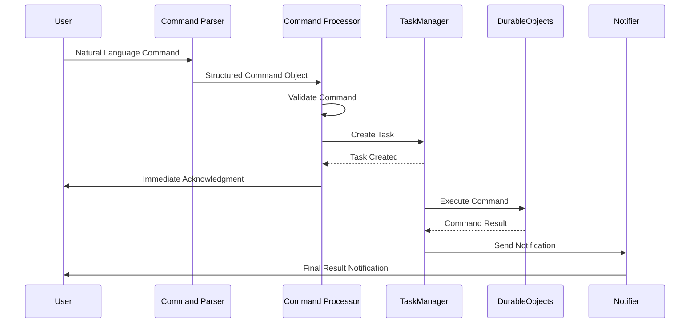
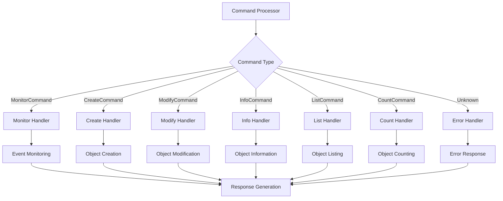

# Command Processor Architecture

This document explains the architecture and implementation of the command processing system used in the Autonomous Development System.

## Overview

The Command Processor is responsible for executing commands that have been parsed by the Command Parser. It takes structured command objects and performs the appropriate actions, such as creating objects, modifying existing objects, or setting up event monitoring.

## Architecture

The Command Processor is implemented in the `Realworld.VoiceCommands.CommandProcessor` module and consists of the following components:

1. **Command Dispatcher**: Routes commands to the appropriate handler based on their type
2. **Command Handlers**: Specialized handlers for each command type
3. **Task Management**: Creates and manages asynchronous tasks for long-running operations
4. **Response Generation**: Generates appropriate responses to commands
5. **Error Handling**: Handles errors that occur during command execution

## Command Processing Flow

The command processing flow follows these steps:

1. **Command Reception**: The processor receives a command object from the parser
2. **Command Validation**: The command is validated to ensure it has all required parameters
3. **Task Creation**: For long-running operations, a task is created to execute the command asynchronously
4. **Command Execution**: The command is executed by the appropriate handler
5. **Response Generation**: A response is generated based on the execution result
6. **Notification**: The user is notified of the result via their preferred method (voice, SMS, etc.)



## Implementation

The main processing function is `process/1`, which takes a command object and returns a result:

```elixir
def process(command, opts \\ []) do
  case command do
    %MonitorCommand{} -> 
      process_monitor_command(command, opts)
      
    %CreateCommand{} -> 
      process_create_command(command, opts)
      
    %ModifyCommand{} -> 
      process_modify_command(command, opts)
      
    %InfoCommand{} -> 
      process_info_command(command, opts)
      
    %ListCommand{} -> 
      process_list_command(command, opts)
      
    %CountCommand{} -> 
      process_count_command(command, opts)
      
    _ -> 
      {:error, "Unknown command type"}
  end
end
```

## Command Handlers

Each command type has a specialized handler function:



### Monitor Command Handler

```elixir
defp process_monitor_command(%MonitorCommand{event: event, notification_method: method}, opts) do
  # Create a monitoring task
  task = TaskManager.create_task(%{
    type: "monitor",
    status: "pending",
    details: %{
      event: event,
      notification_method: method
    }
  })
  
  # Execute the task asynchronously
  TaskManager.execute_task(task)
  
  {:ok, "Monitoring task created for event: #{event}"}
end
```

### Create Command Handler

```elixir
defp process_create_command(%CreateCommand{name: name, description: description}, opts) do
  # Create a task for object creation
  task = TaskManager.create_task(%{
    type: "create_object",
    status: "pending",
    details: %{
      name: name,
      description: description
    }
  })
  
  # Execute the task asynchronously
  TaskManager.execute_task(task)
  
  {:ok, "Object creation task started for: #{name}"}
end
```

## Integration with Other Components

The Command Processor integrates with several other system components:

1. **Task Manager**: For creating and managing asynchronous tasks
2. **Durable Objects**: For creating and modifying objects
3. **Notification System**: For sending notifications to users
4. **Event System**: For monitoring and responding to events

## Asynchronous Processing

Many commands involve long-running operations that are processed asynchronously:

1. The processor creates a task with the appropriate parameters
2. The task is executed in the background
3. The user receives an immediate acknowledgment
4. When the task completes, the user is notified of the result

## Error Handling

The processor includes robust error handling to deal with various failure scenarios:

1. **Command Validation Errors**: When a command is missing required parameters
2. **Execution Errors**: When an error occurs during command execution
3. **Resource Not Found Errors**: When a referenced resource (e.g., an object) doesn't exist
4. **Permission Errors**: When the user doesn't have permission to execute a command

## Example Usage

```elixir
# Process a command
result = CommandProcessor.process(%CreateCommand{
  name: "WeatherWidget",
  description: "A widget that displays weather information"
})

# Handle the result
case result do
  {:ok, message} -> 
    # Success
    IO.puts(message)
  {:error, reason} -> 
    # Error
    IO.puts("Error: #{reason}")
end
```

## Extending the Processor

To add support for new command types:

1. Define a new command struct in the appropriate module
2. Add a new pattern match in the `process/1` function
3. Implement a processing function for the new command type
4. Update any related components (e.g., Task Manager) to handle the new command type

## Future Improvements

Planned improvements to the Command Processor include:

1. Enhanced error recovery mechanisms
2. Support for command prioritization
3. Improved progress tracking for long-running operations
4. Better integration with the event monitoring system
