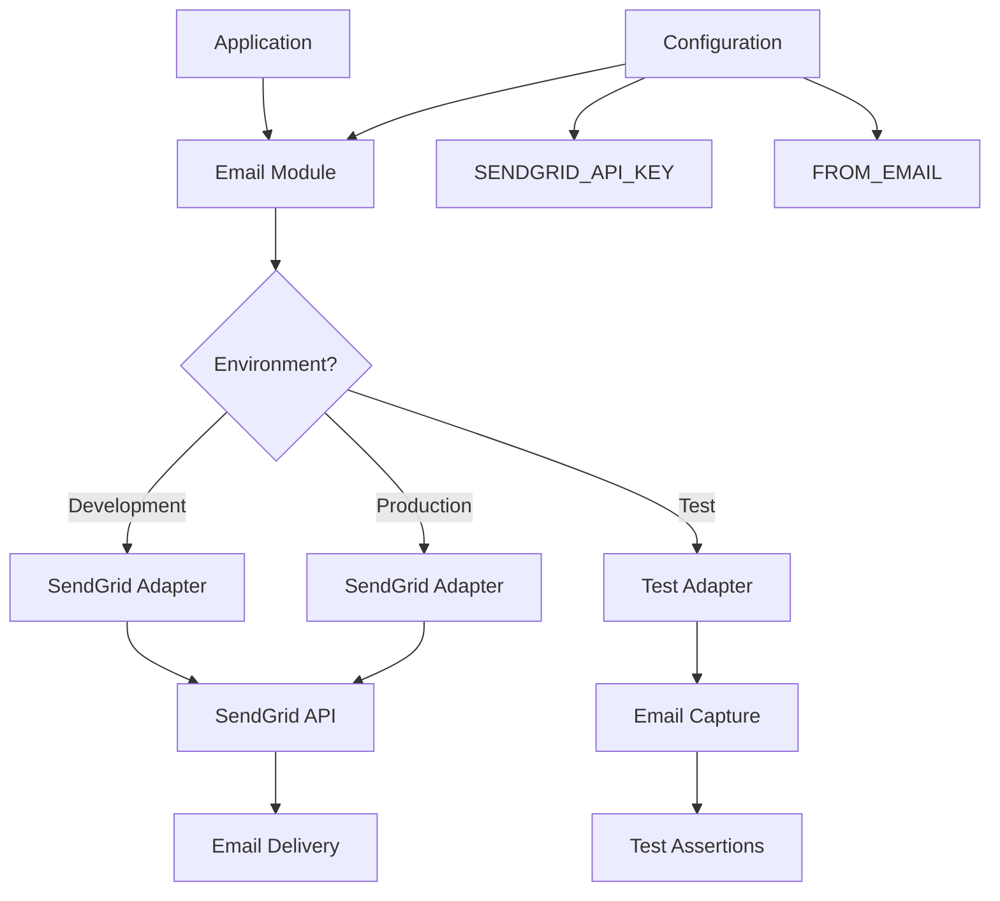

# Email Configuration Guide

This document explains how to configure and use email functionality in the Autonomous Development System.

## Configuration

The system uses [Bamboo](https://github.com/thoughtbot/bamboo) for sending emails. The configuration varies by environment:

### Development Environment

In development, the system is configured to use `Bamboo.SendGridAdapter` to send real emails via SendGrid.

Required environment variables:
- `SENDGRID_API_KEY`: Your SendGrid API key
- `FROM_EMAIL`: The verified sender email address (must be verified in SendGrid)

### Test Environment

In test environment, the system uses `Bamboo.TestAdapter` which captures emails for testing but doesn't actually send them.

### Production Environment

In production, the system uses `Bamboo.SendGridAdapter` to send real emails via SendGrid.

Required environment variables:
- `SENDGRID_API_KEY`: Your SendGrid API key
- `FROM_EMAIL`: The verified sender email address (must be verified in SendGrid)

## Email Structure

The Email module returns a nested result structure when sending emails:

1. The outer result is a tuple with format `{:ok, inner_result}` or `{:error, reason}`
2. The inner result is also a tuple with format `{:ok, %Bamboo.Email{...}}` or `{:error, reason}`

This double-nested structure requires pattern matching like:
```elixir
case result do
  {:ok, {:ok, email}} ->
    # Success case - email is a Bamboo.Email struct
  {:ok, {:error, reason}} ->
    # Inner error case
  {:error, reason} ->
    # Outer error case
end
```

## Email Flow

The following diagram illustrates the email sending process:



## Testing Email Functionality

### Checking Test Emails

To check emails captured by the TestAdapter (in test environment):
```
mix run debug_email_test.exs
```

### Sending Real Emails

#### Via SendGrid
```
SENDGRID_API_KEY=your_api_key FROM_EMAIL=your_verified_email@example.com TEST_EMAIL=recipient@example.com mix run send_sendgrid_email.exs
```

#### Via Outlook SMTP
```
OUTLOOK_EMAIL=your_email@outlook.com OUTLOOK_PASSWORD=your_password TEST_EMAIL=recipient@example.com mix run send_outlook_email.exs
```

### Checking SendGrid Email Activity
```
SENDGRID_API_KEY=your_api_key mix run check_sendgrid_activity.exs
```

## Important Notes

1. Make sure your sender email is verified in SendGrid before sending real emails.
2. In development, real emails will be sent by default. If you want to use the TestAdapter in development, you can change the configuration in `config/dev.exs`.
3. The email module handles both text and HTML email content.
