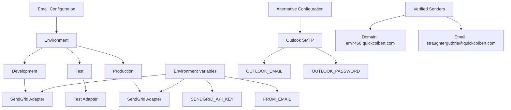

# Email Configuration Update

## Current Status

The email system has been successfully configured to use real email sending with SendGrid as the default adapter in both development and production environments.

### SendGrid Configuration

1. The SendGrid API key is set in the `.env` file as `SENDGRID_API_KEY`.
2. The sender email address is set as `FROM_EMAIL` in the `.env` file.
3. **Important**: The sender email has been configured to use the verified sender identity `straughterguthrie@quickcolbert.com`.

SendGrid has two verified sender identities available:
- Domain Authentication: `em7466.quickcolbert.com` (verified)
- Single Sender Verification: `straughterguthrie@quickcolbert.com` (verified)

Either of these can be used as the `FROM_EMAIL` value.

### Alternative: Outlook SMTP Configuration

As an alternative to SendGrid, you can use Outlook's SMTP server:

1. Set `OUTLOOK_EMAIL` and `OUTLOOK_PASSWORD` in your `.env` file with your actual Outlook credentials
2. Run the script `send_outlook_email_with_env.exs` to send emails via Outlook SMTP

## Testing Email Functionality

Two scripts have been created to test email sending:

1. `send_email_with_env.exs` - Tests sending emails via SendGrid (WORKING)
2. `send_outlook_email_with_env.exs` - Tests sending emails via Outlook SMTP (requires valid Outlook credentials)

Both scripts load environment variables from the `.env` file before sending emails.

## Configuration Files

The email configuration is set up in the following files:

1. `config/config.exs` - Base configuration with `Bamboo.TestAdapter` as fallback
2. `config/dev.exs` - Development configuration using `Bamboo.SendGridAdapter`
3. `config/prod.exs` - Production configuration using `Bamboo.SendGridAdapter`
4. `config/runtime.exs` - Runtime configuration for production using `Bamboo.SendGridAdapter`
5. `config/test.exs` - Test configuration using `Bamboo.TestAdapter`



## Important Note on Email Result Structure

The Email module returns a nested result structure when sending emails:

```elixir
case result do
  {:ok, {:ok, email}} ->
    # Success case - email is a Bamboo.Email struct
  {:ok, {:error, reason}} ->
    # Inner error case
  {:error, reason} ->
    # Outer error case
end
```

This structure is used consistently across all email-sending functions in the system.
