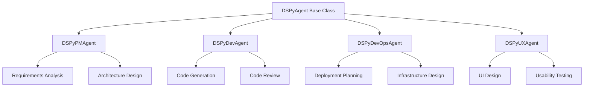

# AIDevOS - AI-Driven Autonomous DevOps System

AIDevOS is a self-evolving AI DevOps system that automates the development, deployment, and evolution of SaaS applications using AI-driven multi-agent collaboration and Durable Objects (DOs).

## 🚀 Overview

AIDevOS enables:
1. Receiving a product spec from a user or business requirement
2. AI agents discussing and refining the architecture
3. Durable Objects acting as modular microservices
4. AI writing, testing, and deploying code iteratively
5. The system expanding itself dynamically as complexity grows

## 🏗️ Core Components

### 1. Multi-LLM Chat System
- AI agents with distinct roles: PM, Backend, Frontend, DevOps, QA, Security
- Uses debate/reflection cycles to refine architecture
- Output: System architecture + task breakdown

### 2. Durable Objects (DOs) for Microservices
- Each DO acts as an independent service with its own logic
- AI deploys DOs dynamically to expand functionality
- AI can redeploy DOs to evolve architecture

### 3. AI-Driven CI/CD Pipeline
- AI writes code → runs tests → deploys via a pipeline
- If an issue is found, AI refines and redeploys
- Logs and feedback loops ensure continuous improvement

### 4. Self-Improving Deployment Engine
- AI monitors performance and resource utilization
- Spins up new DOs or refactors existing ones
- Uses reinforcement learning to optimize architecture

## 📊 Architecture Diagrams

Detailed architecture diagrams are available in the [docs/architecture](./docs/architecture) directory:

- [System Architecture](./docs/architecture/system-architecture.md): High-level overview of the AIDevOS system
- [Multi-Agent Workflow](./docs/architecture/multi-agent-workflow.md): Collaboration workflow between AI agents
- [Durable Objects Architecture](./docs/architecture/durable-objects-architecture.md): Microservices architecture
- [CI/CD Pipeline Architecture](./docs/architecture/cicd-pipeline.md): AI-driven CI/CD pipeline
- [Implementation Roadmap](./docs/architecture/implementation-roadmap.md): Development phases and milestones

## 🖥️ Frontend UI

The AIDevOS system features a modern, responsive web interface built with:

- **React**: Component-based UI library
- **TypeScript**: Type-safe JavaScript
- **TailwindCSS**: Utility-first CSS framework
- **Redux Toolkit**: State management
- **React Router**: Navigation and routing

### Key Features:
- Dashboard for system monitoring and overview
- Agent management and collaboration views
- Deployment tracking and visualization
- Performance monitoring and analytics
- Dark/light mode support
- Responsive design for all device sizes

### UI Components:
- Reusable UI component library
- Accessible interface (WCAG AA compliance)
- Interactive visualizations for system performance
- Real-time updates for system events

### Getting Started with the Frontend:
```bash
# Navigate to frontend directory
cd src/frontend

# Install dependencies
npm install

# Start development server
npm run dev

# Run tests
npm test

# Build for production
npm run build
```

For more details, see [src/frontend-plan.md](./src/frontend-plan.md).

## 🤖 Claude Code Integration

AIDevOS can be enhanced with Claude Code, an agentic coding tool from Anthropic:

- [Claude Code Integration](./docs/claude-code-integration.md): Detailed guide on integrating Claude Code with AIDevOS
- [Claude Code Prompts](./docs/claude-code-prompts.md): Specialized prompts for each agent role
- [Agent SOPs](./docs/aidevos-agent-sops.md): Comprehensive Standard Operating Procedures for each agent
- Enhances multi-agent workflow with AI-powered coding assistance
- Provides implementation plan and best practices for using Claude Code with AIDevOS

## 🧠 DSPy Integration

AIDevOS includes a rich integration with the DSPy framework to enable LLM-powered agents:

### ✨ DSPy Agent Classes
- 📊 `DSPyPMAgent`: Project management tasks including requirements analysis and architecture design
- 💻 `DSPyDevAgent`: Development tasks including code generation and code review
- 🔧 `DSPyDevOpsAgent`: DevOps tasks including deployment planning and infrastructure design
- 🎨 `DSPyUXAgent`: UX tasks including UI design and usability testing

### 🔄 Agent Architecture


All agent classes implement a standardized `process_task` async method, allowing seamless integration with both synchronous and asynchronous workflows.

### Key DSPy Features in AIDevOS:

- **DSPy-enabled Agents**: Each agent role (PM, Dev, DevOps, UX) has a DSPy-powered version
- **Optimizable Modules**: Agent capabilities are built as DSPy modules that can be optimized
- **Pluggable LLM Support**: Compatible with OpenAI, Anthropic, and other LLM providers
- **Structured Reasoning**: DSPy's structured signatures provide better reasoning patterns

### Getting Started with DSPy Integration:

```bash
# Install DSPy dependencies
pip install -r requirements-dspy.txt

# Set your API key in environment variables
export OPENAI_API_KEY="your-key-here"

# Run the DSPy-enabled team collaboration
python src/dspy_team_collaboration.py
```

For more details, see the implementation in:
- `src/agents/dspy_modules.py`: DSPy module implementations
- `src/agents/dspy_agent.py`: DSPy-enabled agent classes
- `src/dspy_team_collaboration.py`: Main implementation using DSPy agents
- `src/config/dspy_config.py`: Configuration for DSPy (API keys, models)

## 🔄 Self-Modifying Code Capability

AIDevOS now includes a powerful self-modification system that allows agents to improve their own code:

- **Auto-Generated Improvements**: Agents analyze their performance and generate code improvements
- **GitHub Integration**: Automatic branch creation, commits, and pull requests
- **Durable Objects Enhancement**: Durable Objects can now evolve their own implementation
- **Feedback Loop**: Performance metrics drive continuous code optimization

### Key Self-Modification Features:

- **Code Mutator Engine**: Core system for modifying code based on AI-generated prompts
- **Self-Improvement Analysis**: Identifies optimization opportunities based on metrics
- **Version Control Integration**: Safely deploys changes through GitHub workflow
- **Transparent Explanations**: All modifications include detailed explanations

### Getting Started with Self-Modifying Agents:

```bash
# Set up GitHub integration
export GITHUB_TOKEN="your-token-here"
export GITHUB_REPOSITORY="your-username/your-repo"

# Run the self-modifying agent example
python examples/self_modifying_agent.py
```

For more details, see the implementation in:
- `src/deployment/code_mutator.py`: Core implementation of code modification capabilities
- `src/deployment/self_improvement.py`: Performance analysis and optimization identification
- `examples/self_modifying_agent.py`: Example of a self-modifying DSPy agent

## 🛠️ Development Workflow

AIDevOS uses a multi-branch collaborative approach:

1. **PM-Architecture Branch**: System design, feature planning, and architecture
2. **Backend-DB Branch**: API design, database models, and business logic
3. **Frontend-UI Branch**: UI/UX design, frontend components, and user interactions
4. **DevOps-QA Branch**: CI/CD pipeline, testing, deployment, and monitoring
5. **Main Branch**: Integration, merging, and release management

For more details, see [docs/multi-agent-workflow.md](./docs/multi-agent-workflow.md).

## 🚀 Getting Started

### Prerequisites
- Python 3.8+
- Git
- tmux (for multi-agent workflow)
- Node.js 18+ (for frontend development)

### Setup

1. Clone the repository:
   ```bash
   git clone https://github.com/yourusername/aidevos.git
   cd aidevos
   ```

2. Install dependencies:
   ```bash
   pip install -r requirements.txt
   ```

3. Set up environment variables:
   ```bash
   cp .env.example .env
   # Edit .env with your API keys and configuration
   ```

4. Start the multi-agent tmux session:
   ```bash
   ./setup-aidevos-team.sh
   ```

## 📝 License

This project is licensed under the MIT License - see the LICENSE file for details.

## 🤝 Contributing

Contributions are welcome! Please feel free to submit a Pull Request.
