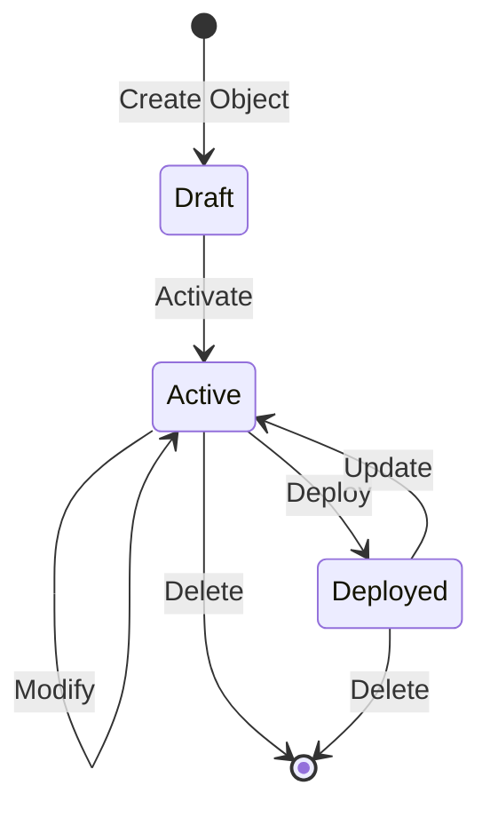
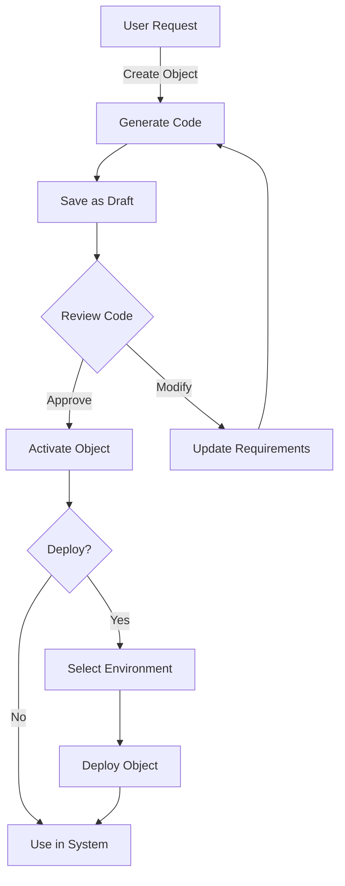

# Durable Object Lifecycle

This document explains the lifecycle of Durable Objects in the system and how to manage them effectively.

## Object States

Durable Objects can exist in the following states:

- **Draft**: Initial state when an object is first created. Objects in draft state are not fully active in the system.
- **Active**: Objects that have been reviewed and activated. Only active objects can be fully used in the system.
- **Deployed**: Objects that have been deployed to a specific environment.



## Object Creation Process

1. **Creation**: Objects can be created in two ways:
   - Manually through the UI form
   - Using AI to generate from scratch based on a description and requirements
   - Via voice commands using the Twilio integration

2. **Draft State**: All newly created objects start in the "draft" state, which means:
   - They are saved in the database
   - Their code is written to the filesystem
   - They are visible in the UI
   - They cannot be fully used until activated

3. **Activation**: To make a draft object fully usable:
   - Select the object in the UI
   - Click the "Activate Object" button that appears for draft objects
   - The object status will change to "active"

4. **Modification**: Objects can be modified using AI:
   - Select the object
   - Click the "Modify" button
   - Provide a description of the desired changes
   - The system will generate updated code

5. **Deployment**: Active objects can be deployed to different environments:
   - Development
   - Staging
   - Production



## Voice Command Integration

When creating objects via voice commands:

1. The object will be created in "draft" status
2. You will be informed that the object needs activation
3. You must use the UI to activate the object before it can be fully used

## Best Practices

- **Review Before Activation**: Always review the generated code before activating an object
- **Test in Development**: Deploy to development first before staging or production
- **Version Control**: Use the rollback feature if needed to revert to previous versions
- **Clear Descriptions**: Provide detailed descriptions when creating or modifying objects

## API Reference

The following functions are available for managing object lifecycle:

```elixir
# Create a new object (draft status)
Realworld.DurableObjects.create_object_from_scratch(name, description, prompt)

# Activate a draft object
Realworld.DurableObjects.activate_object(object)

# Modify an existing object
Realworld.DurableObjects.modify_object(object, prompt)

# Deploy an object to an environment
Realworld.DurableObjects.deploy_object(object, environment)

# Rollback to a previous version
Realworld.DurableObjects.rollback_object(object, version)
```
