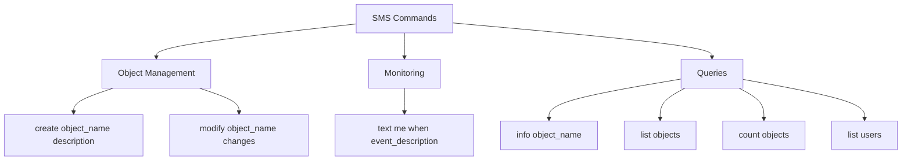
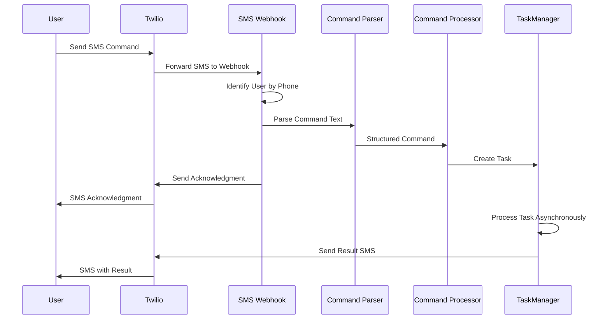

# SMS Integration for Autonomous Development System

This document explains how to use the SMS integration feature to communicate with your Autonomous Development System.

## Overview

The SMS integration allows you to send text messages to your system and have it automatically execute commands or set up monitoring for specific events. This enables you to interact with your system remotely without needing direct access to the codebase.

## Setup Requirements

1. **Twilio Account**: You need a Twilio account with:
   - A Twilio phone number capable of sending/receiving SMS
   - Your account SID and auth token

2. **Environment Variables**: Ensure these are set in your `.env` file:
   ```
   TWILIO_ACCOUNT_SID=your_account_sid
   TWILIO_AUTH_TOKEN=your_auth_token
   TWILIO_PHONE_NUMBER=your_twilio_phone_number
   TWILIO_SMS_WEBHOOK_URL=https://your-domain.com/webhooks/sms
   ```

3. **Webhook Configuration**: In your Twilio dashboard, set up the SMS webhook URL to point to:
   ```
   https://your-domain.com/webhooks/sms
   ```

4. **User Phone Number**: Your phone number must be registered in the system and associated with your user account.

## Available Commands

You can send the following types of SMS commands to your system:



### Create a New Object

```
create [object_name] [object_description]
```

Example:
```
create WeatherWidget A widget that displays current weather information
```

### Modify an Existing Object

```
modify [object_name] [modification_description]
```

Example:
```
modify WeatherWidget Add support for displaying the 5-day forecast
```

### Set Up Event Monitoring

```
text me when [event_description]
```

Example:
```
text me when any user signs up
```

### Query Object Information

```
info [object_name]
```

Example:
```
info WeatherWidget
```

### List All Objects

```
list objects
```

### Count Objects

```
count objects
```

### List Users

```
list users
```

## Command Processing Flow

When you send an SMS to the system, the following process occurs:

1. **Message Receipt**: The SMS is received by your Twilio phone number.
2. **Webhook Trigger**: Twilio sends the message content to your webhook endpoint (`/webhooks/sms`).
3. **User Authentication**: The system identifies you by your phone number.
4. **Command Parsing**: The `SmsController.webhook/2` function processes the message and identifies the command type.
5. **Task Creation**: A task is created to execute your command asynchronously.
6. **Acknowledgment**: An immediate response is sent to confirm receipt of your command.
7. **Command Execution**: The system executes your command in the background.
8. **Result Notification**: Once the command is completed, you receive an SMS with the result.



## Implementation Details

The SMS integration is implemented in the following files:

- `lib/realworld_web/controllers/sms_controller.ex`: Handles incoming SMS webhook requests
- `lib/realworld/integrations/twilio.ex`: Provides functions for sending SMS messages
- `lib/realworld/auto_dev/task_manager.ex`: Manages asynchronous task execution

The `send_sms/3` function in the Twilio module is used to send SMS messages:

```elixir
Realworld.Integrations.Twilio.send_sms(from, to, message)
```

## Troubleshooting

If you're experiencing issues with the SMS integration:

1. **Check Phone Registration**: Ensure your phone number is correctly registered in the system.
2. **Verify Twilio Configuration**: Check that your Twilio account is properly configured.
3. **Command Syntax**: Make sure you're using the correct command syntax.
4. **Webhook URL**: Verify that your webhook URL is correctly set in the Twilio dashboard.
5. **System Logs**: Check the system logs for any errors related to SMS processing.

## Security Considerations

- Phone numbers must be registered in the system to use SMS features
- Sensitive information should never be transmitted via SMS
- Commands are validated before execution to prevent malicious actions

## Example Use Cases

1. **Remote Monitoring**: Set up monitoring for important system events while away from your computer.
2. **Quick Object Creation**: Quickly create new objects when you have an idea on the go.
3. **Status Checks**: Check the status of your system or specific objects from anywhere.
4. **Emergency Modifications**: Make urgent changes to your system when you don't have direct access.
