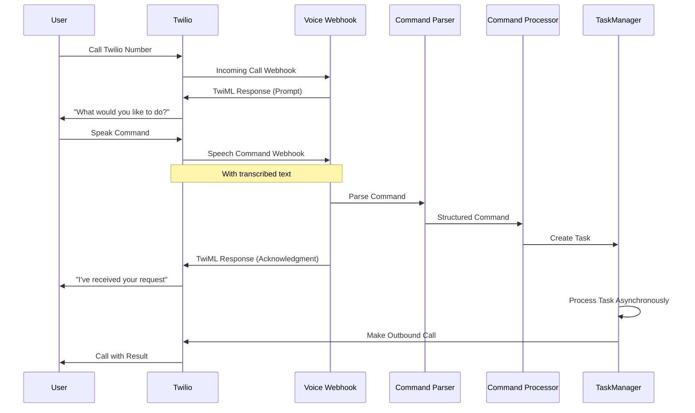

# Voice Call Integration for Autonomous Development System

This document explains how to use the voice call integration feature to communicate with your Autonomous Development System.

## Overview

The voice call integration allows you to make voice calls to your system and have it automatically execute commands or set up monitoring for specific events. This enables you to interact with your system remotely without needing direct access to the codebase.

## Setup Requirements

1. **Twilio Account**: You need a Twilio account with:
   - A Twilio phone number capable of making/receiving voice calls
   - Your account SID and auth token

2. **Environment Variables**: Ensure these are set in your `.env` file:
   ```
   TWILIO_ACCOUNT_SID=your_account_sid
   TWILIO_AUTH_TOKEN=your_auth_token
   TWILIO_PHONE_NUMBER=your_twilio_phone_number
   ```

3. **Webhook Configuration**: In your Twilio dashboard, set up the voice webhook URL to point to:
   ```
   https://your-domain.com/webhooks/voice
   ```

4. **User Phone Number**: Your phone number must be registered in the system and associated with your user account.

## How to Use

1. **Receive a call from the system**: The system can call you to notify you about events.

2. **Make a call to the system**: Call your Twilio phone number. The system will:
   - Answer the call
   - Ask you what you would like it to do
   - Listen for your voice command
   - Confirm receipt of your request
   - Process your request asynchronously
   - Call you back when the task is completed

## Available Commands

You can use the following types of voice commands:

### Set Up Event Monitoring

```
"Call me when [event_description]"
```

or

```
"Notify me when [event_description]"
```

Example:
```
"Call me when any user signs up"
```

This will set up monitoring for the specified event and call you when it occurs.

## How It Works

1. You call your Twilio phone number
2. The system answers and prompts you for a command
3. You speak your command
4. Twilio transcribes your speech and sends it to your webhook endpoint
5. The system identifies you by your phone number
6. Your command is parsed and executed
7. The system confirms receipt of your request
8. When the task is completed, the system calls you back with the result



## Example Use Case

As demonstrated in the example, you can say:

```
"Call me when any user signs up"
```

The system will:
1. Acknowledge your request
2. Create a monitoring task for user signup events
3. Implement the necessary code changes to track signups
4. Deploy the changes
5. Call you when a new user signs up

## Troubleshooting

If you receive an error message, check:
1. Your phone number is correctly registered in the system
2. The command syntax is correct
3. The Twilio webhook is properly configured
4. Your environment variables are set correctly

For further assistance, check the system logs or contact support.
