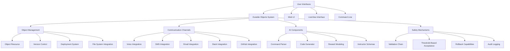
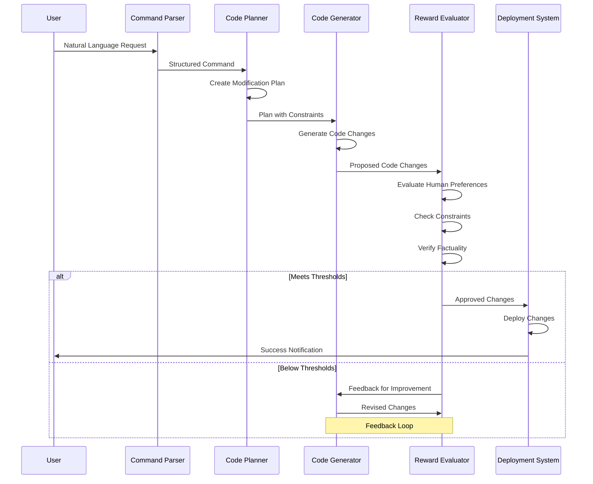

# Self-Modifying Durable Objects with Agentic Reward Modeling

This extension to the RealWorld application demonstrates a system for safely self-modifying code using Ash Framework resources and OpenAI-based reward modeling.

## Key Concepts

### 1. Durable Objects

Durable Objects are persistent, versioned pieces of code that can be modified, deployed, and rolled back. Each object is represented as an Ash Resource with:

- Identifier and metadata
- Code content and optional API schema
- Version history and modification records
- Status tracking (draft, deployed, failed, deprecated)

### 2. Agentic Reward Modeling (ARM)

The Self-Modifying Objects system incorporates ARM to ensure that code modifications align with human preferences and maintain correctness:

- **Human Preference Evaluation**: Measures readability, maintainability, elegance, documentation quality
- **Constraint Checking**: Ensures modifications adhere to constraints in the original code and API schema
- **Factuality Verification**: Validates the correctness of implemented algorithms and domain-specific knowledge

### 3. Safety Mechanisms

Multiple layers of safety are built into the system:

- **Validation Chain**: Every modification passes through planning, generation, and multi-dimensional evaluation
- **Threshold-Based Acceptance**: Modifications are only accepted if they meet configurable quality thresholds
- **Version Control**: Complete history with rollback capabilities
- **Memory-Aware Mutations**: System records all modifications and evaluations for transparency and auditing

## Implementation Details

### Core Components

1. **Object Resource**: Defines the Durable Object structure and relationships
2. **Instructor Models**: Structured inputs and outputs using instructor_ex
3. **Reward Evaluator**: Components that analyze code modifications across different dimensions
4. **Code Modification Pipeline**: Orchestrates the planning, generation, and evaluation steps
5. **Creation Pipeline**: Generates new code and files from scratch based on requirements
6. **Deployment System**: Safely loads and tests modified code
7. **LiveView Interface**: User interface for managing objects and modifications
8. **Voice Command Integration**: Control and query the system using voice commands via Twilio
9. **SMS Integration**: Interact with the application through text messages
10. **Email Integration**: Send notifications and updates to users
11. **Slack Integration**: Send messages to Slack channels
12. **GitHub Integration**: Interact with GitHub repositories



### Key Files

- `lib/realworld/durable_objects/object.ex`: Core resource definition
- `lib/realworld/durable_objects/models/*.ex`: Structured data models
- `lib/realworld/durable_objects/reward_modeling/*.ex`: Evaluation components
- `lib/realworld/durable_objects/changes/*.ex`: Code mutation, creation, and deployment logic
- `lib/realworld/durable_objects/file_system.ex`: File system integration for code files
- `lib/realworld_web/live/durable_object_live.ex`: Phoenix LiveView 

## Communication Channels

The system supports multiple communication channels for interacting with durable objects:

### Voice Integration

The voice command system allows users to interact with the application through phone calls:

1. **Incoming Calls**:
   - Users can call a Twilio phone number connected to the system
   - The system authenticates users by their registered phone number
   - Voice commands are processed using speech-to-text and natural language parsing

2. **Voice Command Processing**:
   - Commands are parsed by the `CommandParser` module
   - Parsed commands are executed by the `CommandProcessor` module
   - Results are communicated back to the user via text-to-speech

3. **Outgoing Calls**:
   - The system can make calls to users for notifications
   - Voice calls can deliver status updates about tasks or monitored events
   - Implementation uses Twilio's API via the `make_call/3` function

4. **Webhook Endpoints**:
   - `/webhooks/voice` - Initial call handling
   - `/webhooks/voice/command` - Speech command processing

### SMS Integration

The SMS system allows users to interact with the application through text messages:

1. **Incoming SMS**:
   - Users can send text commands to a Twilio phone number
   - The system authenticates users by their registered phone number
   - Text commands are parsed and executed

2. **SMS Command Processing**:
   - Commands follow a simple syntax (e.g., "create object Calculator")
   - Parsed commands create tasks that are processed asynchronously
   - Results are communicated back to the user via SMS

3. **Outgoing SMS**:
   - The system can send SMS notifications to users
   - SMS can deliver status updates about tasks or monitored events
   - Implementation uses Twilio's API via the `send_sms/3` function

4. **Webhook Endpoint**:
   - `/webhooks/sms` - Processes incoming SMS messages

### Email Integration

The email system allows the application to send notifications and updates to users:

1. **Email Capabilities**:
   - Send simple text/HTML emails using `send_email/4`
   - Send task notifications using `send_task_notification/2`
   - Support for custom templates and formatting

2. **Implementation**:
   - Uses Bamboo for email delivery
   - Configurable sender address and formatting options
   - Support for both text and HTML email content

### Slack Integration

The Slack integration allows the application to send messages to Slack channels:

1. **Slack Capabilities**:
   - Send messages to channels using `send_message/3`
   - Get channel information using `get_channel_info/1`
   - Support for rich formatting and blocks

2. **Implementation**:
   - Uses Slack's API for message delivery
   - Configurable authentication via environment variables
   - Support for advanced message formatting

### GitHub Integration

The GitHub integration allows the application to interact with GitHub repositories:

1. **GitHub Capabilities**:
   - Create issues using `create_issue/3`
   - Get repository information
   - Support for labels, assignees, and other issue metadata

2. **Implementation**:
   - Uses GitHub's API for repository interaction
   - Configurable authentication via environment variables
   - Support for advanced issue formatting

## Event Monitoring

The system includes a monitoring framework that allows users to set up notifications for specific events:

1. **Monitor Creation**:
   - Users can create monitors for system events (e.g., "call me when a user signs up")
   - Monitors can be created via voice, SMS, or the web interface

2. **Notification Delivery**:
   - When monitored events occur, notifications are sent via the user's preferred channel
   - Supported channels include voice calls, SMS, email, and Slack
   - Notifications include relevant details about the event

## AI Components

The system leverages several AI components to enable its self-modifying capabilities:

1. **Command Parser**:
   - Parses natural language commands into structured command objects
   - Identifies command intent and extracts parameters
   - Handles ambiguity and variations in command phrasing

2. **Code Generator**:
   - Creates new code from natural language descriptions
   - Uses OpenAI's GPT models for code generation
   - Ensures generated code meets quality standards

3. **Reward Modeling**:
   - Evaluates code changes against human preferences
   - Includes factuality checking, constraint checking, and preference evaluation
   - Provides feedback to improve code quality

4. **Instructor Schemas**:
   - Structured schemas for AI outputs
   - Ensures consistency and validation of AI-generated content
   - Includes schemas for code plans, constraint checks, and more



## Environment Variables

The system requires several environment variables to be set:

```
# Twilio Configuration
TWILIO_ACCOUNT_SID=your_account_sid
TWILIO_AUTH_TOKEN=your_auth_token
TWILIO_PHONE_NUMBER=your_phone_number

# Slack Configuration
SLACK_BOT_TOKEN=your_slack_bot_token

# GitHub Configuration
GITHUB_TOKEN=your_github_token
GITHUB_REPO=your_github_repo

# Email Configuration
SMTP_USERNAME=your_smtp_username
SMTP_PASSWORD=your_smtp_password
SMTP_HOST=your_smtp_host
SMTP_PORT=your_smtp_port
FROM_EMAIL=your_from_email
```

## Getting Started

### Setup

1. Make sure dependencies are installed:
   ```bash
   mix deps.get
   ```

2. Create and migrate the database:
   ```bash
   mix ecto.setup
   ```

3. Start the Phoenix server:
   ```bash
   mix phx.server
   ```

4. Visit [`localhost:4000/durable-objects`](http://localhost:4000/durable-objects) to manage your Durable Objects

### Configuration

Configure OpenAI API keys in your environment:

```bash
export OPENAI_API_KEY=your_api_key_here
```

### Creating a Self-Modifying Object

#### Method 1: Manual Creation
1. Use the web interface to create a new Durable Object with initial code
2. Provide a modification prompt describing the desired changes
3. The system will plan, generate, and evaluate the modifications
4. If the changes meet quality thresholds, the object will be updated
5. Deploy the object to make it active in the system

#### Method 2: Creation From Scratch
1. Click "Create From Scratch" on the Durable Objects page
2. Provide a name, description, and detailed requirements
3. The system will:
   - Plan the implementation based on requirements
   - Generate code and file structure
   - Evaluate the generated code against constraints and preferences
   - Create the object and write files to the file system
4. Once created, you can further modify or deploy the object

## Use Cases

- **Self-extending APIs**: APIs that can evolve based on usage patterns
- **Adaptive Data Models**: Resources that adjust their structure based on data trends
- **Learning System Components**: System parts that improve through feedback loops
- **AI-assisted Refactoring**: Code that gets continuously improved with minimal human intervention
- **Rapid Prototyping**: Quickly generate new components from natural language descriptions

## Future Enhancements

- **Local Model Support**: Integration with local LLMs for offline operation
- **Learning from Rejections**: System improvement based on failed modifications
- **Multi-Agent Review**: Multiple specialized evaluation agents for different aspects
- **User Feedback Loop**: Incorporating explicit user feedback into the reward model
- **Project Generation**: Create entire projects with multiple interconnected components

## Security Considerations

This system allows code to modify itself, which inherently carries risks. Always:

1. Run in a sandboxed environment
2. Limit the scope of what self-modifying objects can access
3. Monitor for unusual behavior
4. Maintain multiple backups and rollback capabilities
5. Consider a human-in-the-loop approach for critical systems
