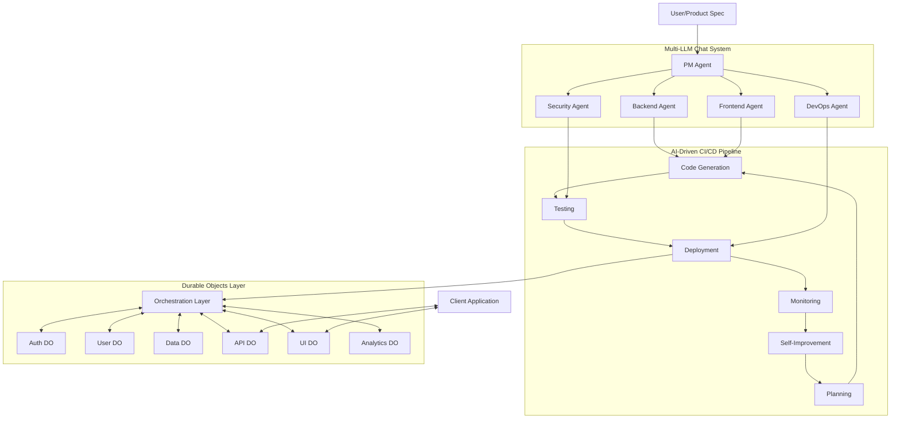
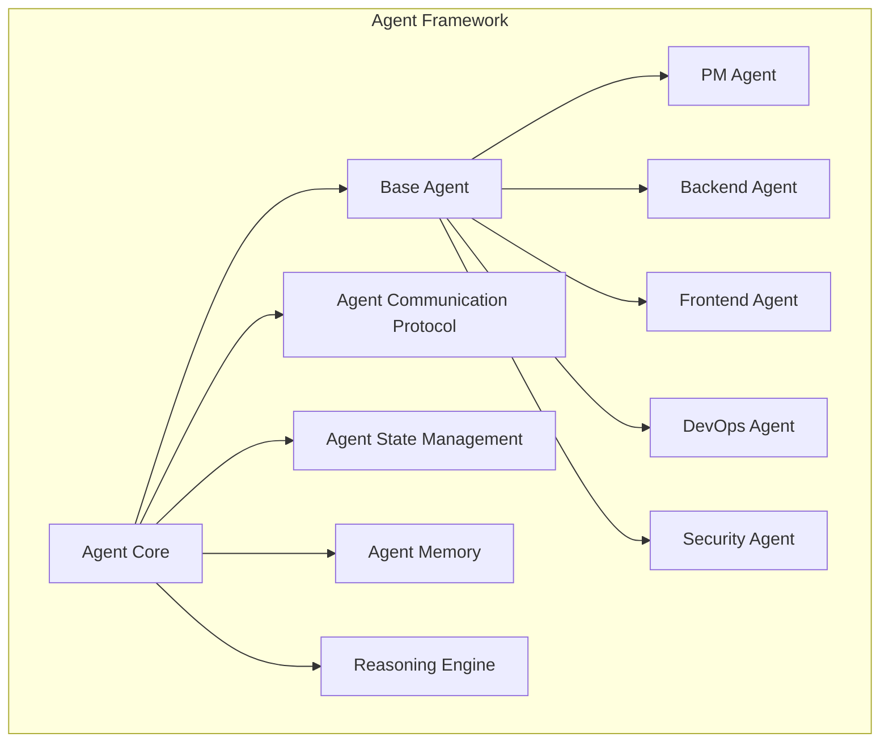
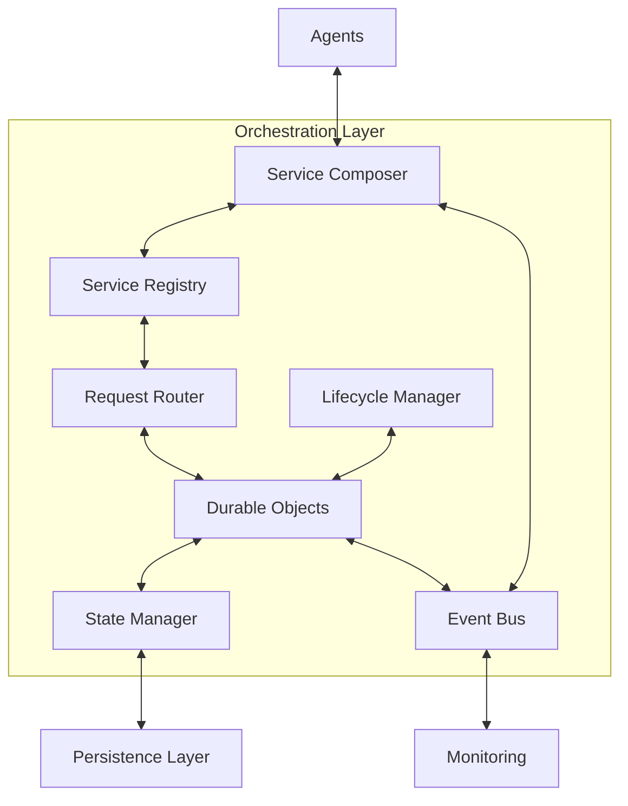
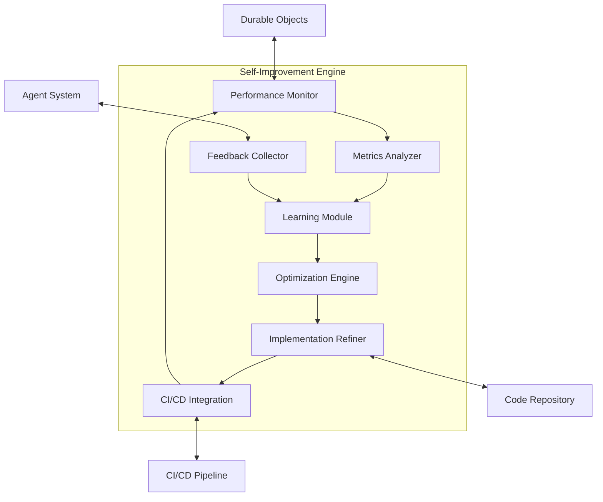
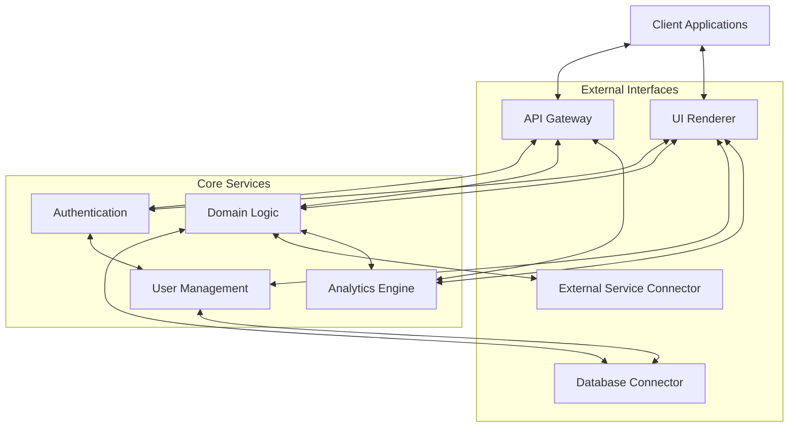
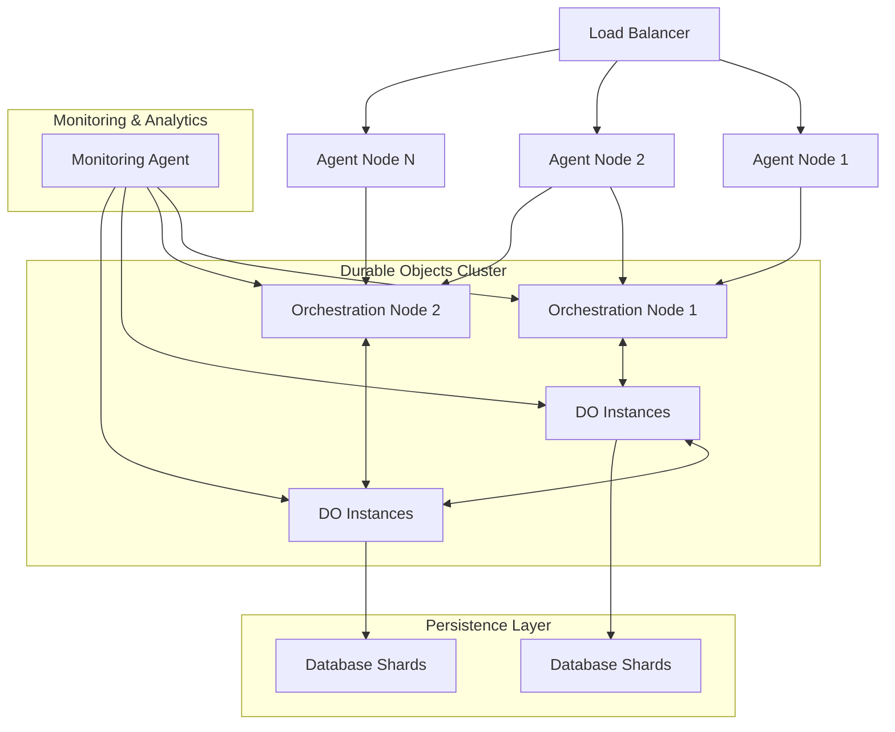

# AIDevOS Architecture Refinement Plan

This document outlines architectural refinements and enhancements for the AIDevOS system based on analysis of the current architecture and implementation status.

## Current Architecture Analysis



### Key Findings

1. **Implementation Gap**: The project documentation is thorough but implementation is minimal.
2. **Orchestration Layer Definition**: The interface between agents and Durable Objects needs more precise definition.
3. **Self-Improvement Mechanism**: Currently underspecified for practical implementation.
4. **Data Flow**: The flow between agents, CI/CD pipeline, and Durable Objects requires refinement.
5. **Scalability**: The current architecture doesn't fully address horizontal scaling challenges.

## Architecture Refinements

### 1. Modular Agent Architecture



**Justification**: The refined agent architecture separates concerns between core agent functionality and specialized agents. This provides:
- Easier extension with new agent types
- Consistent communication protocols
- Reusable logic for common functionality
- Clear interfaces for agent-to-agent and agent-to-system interactions

### 2. Enhanced Orchestration Layer



**Justification**: The enhanced orchestration layer adds a Service Composer component that:
- Assembles complex services from multiple Durable Objects
- Provides higher-level composability for building complex applications
- Simplifies agent interaction with the Durable Objects ecosystem
- Creates a clear boundary between agent logic and service implementation

### 3. Self-Improvement Architecture



**Justification**: The self-improvement architecture creates a concrete feedback loop with:
- Specific metrics collection points
- Analysis pipeline for identifying improvement areas
- Learning module to capture patterns and accumulate knowledge
- Practical integration with code repositories and CI/CD pipelines
- Clear mechanism for implementing optimizations

### 4. Data Flow Architecture



**Justification**: The data flow architecture:
- Clearly separates external interfaces from core services
- Defines relationships between different service domains
- Creates a consistent security boundary through authentication
- Provides explicit analytics integration points
- Simplifies client application integration

### 5. Scalability Architecture



**Justification**: The scalability architecture:
- Supports horizontal scaling of agent nodes
- Distributes orchestration across multiple nodes
- Clusters Durable Objects with inter-cluster communication
- Shards database access for performance
- Includes dedicated monitoring across all system components

## Feature Roadmap

Based on the architectural refinements, here is the prioritized feature roadmap for the next development cycle:

| Priority | Feature | Description | Component | Complexity |
|----------|---------|-------------|-----------|------------|
| 1 | Basic Agent Framework | Core agent abstractions, communication protocol, state management | Multi-LLM Chat | High |
| 2 | Service Registry | Core component for DO registration and discovery | Orchestration | Medium |
| 3 | Simple Durable Object | Base DO implementation with lifecycle management | Durable Objects | High |
| 4 | Agent State Persistence | Mechanism for saving and loading agent state | Multi-LLM Chat | Medium |
| 5 | Basic CI/CD Integration | Initial integration with code generation and testing | CI/CD Pipeline | Medium |
| 6 | Event Bus Implementation | Communication backbone for system events | Orchestration | High |
| 7 | Metrics Collection | Foundational metrics gathering for performance | Monitoring | Medium |
| 8 | Simple UI Dashboard | Basic management interface for system control | Frontend | Medium |
| 9 | Agent Specialization | Role-specific agent implementations | Multi-LLM Chat | High |
| 10 | Authentication Service | Basic security implementation | Durable Objects | Medium |

## Acceptance Criteria

Each feature will be considered complete when it meets these criteria:

### 1. Basic Agent Framework

- [ ] Base agent class implemented with common functionality
- [ ] Agent communication protocol defined and implemented
- [ ] State management interface created
- [ ] At least one specialized agent implemented (PM Agent)
- [ ] Unit tests cover core functionality
- [ ] Agent creation and initialization demonstrated

### 2. Service Registry

- [ ] Registry implementation with registration API
- [ ] Service discovery mechanism working
- [ ] Metadata storage for service information
- [ ] Query interface for finding services
- [ ] Unit tests cover registration and discovery
- [ ] Sample service registration demonstrated

### 3. Simple Durable Object

- [ ] Base DO class with core functionality
- [ ] State loading and saving mechanisms
- [ ] Lifecycle hooks (initialize, activate, deactivate)
- [ ] Message handling interface
- [ ] Unit tests for lifecycle and state management
- [ ] Simple DO creation and usage demonstrated

## Task Breakdown

### Basic Agent Framework Implementation

1. Create base agent class with core functionality
   - Assigned to: Backend Agent
   - Estimated effort: 3 days
   - Dependencies: None

2. Implement agent communication protocol
   - Assigned to: Backend Agent
   - Estimated effort: 2 days
   - Dependencies: Base agent class

3. Develop state management interface
   - Assigned to: Backend Agent
   - Estimated effort: 2 days
   - Dependencies: Base agent class

4. Implement PM Agent specialization
   - Assigned to: PM Agent
   - Estimated effort: 3 days
   - Dependencies: Base agent class, communication protocol

5. Create unit tests for agent framework
   - Assigned to: DevOps Agent
   - Estimated effort: 2 days
   - Dependencies: All agent implementations

6. Document agent framework architecture and usage
   - Assigned to: PM Agent
   - Estimated effort: 1 day
   - Dependencies: All previous tasks

## Architectural Decision Records

### ADR-1: Agent Communication Protocol

**Status**: Proposed

**Context**: Agents need to communicate efficiently while maintaining a clear record of interactions, decisions, and reasoning.

**Decision**: Implement a structured message protocol with the following properties:
- JSON-based message format
- Required fields: sender, recipient, messageType, content, timestamp, messageId
- Optional fields: replyTo, metadata, attachments
- Support for broadcast messages to all agents
- Asynchronous message delivery with acknowledgments
- Persistence of message history

**Consequences**:
- All agent communication will be structured and traceable
- Message history provides context for decision-making
- Protocol overhead is acceptable for the benefits gained
- Future extensions can build on the established message structure

### ADR-2: Durable Object State Management

**Status**: Proposed

**Context**: Durable Objects need efficient state management that supports persistence, consistency, and scaling.

**Decision**: Implement a two-tiered state management approach:
- In-memory state for active operations
- Persistent state backed by a document database
- Optimistic concurrency control for state updates
- Event-sourced design for change tracking
- State versioning for migrations

**Consequences**:
- Objects can be efficiently hibernated and revived
- State history provides audit trail and recovery options
- Performance overhead for persistence is manageable
- Additional complexity in state management logic
- Requires careful handling of schema evolution

## Technical Guidance for Other Agents

### For Backend Agent

1. Focus on implementing the base agent class with these core methods:
   ```python
   class BaseAgent:
       def __init__(self, agent_id, role, capabilities):
           pass
       
       async def receive_message(self, message):
           pass
           
       async def send_message(self, recipient, content, message_type="standard"):
           pass
           
       async def process_task(self, task):
           pass
           
       async def save_state(self):
           pass
           
       async def load_state(self, state_id):
           pass
   ```

2. For the Service Registry, implement these key interfaces:
   ```python
   class ServiceRegistry:
       async def register_service(self, service_id, metadata, endpoints):
           pass
           
       async def discover_service(self, criteria):
           pass
           
       async def update_service(self, service_id, metadata=None, endpoints=None):
           pass
           
       async def deregister_service(self, service_id):
           pass
           
       async def list_services(self, filter_criteria=None):
           pass
   ```

### For Frontend Agent

1. Design the UI dashboard with these key components:
   - System overview with active agents and services
   - Service registry browser
   - Agent communication monitor
   - Task queue and status viewer
   - Performance metrics display
   - Configuration interface

2. Implement the dashboard using a component-based framework with:
   - Responsive design for different screen sizes
   - Real-time updates using WebSockets
   - Modular architecture for easy extension
   - Comprehensive API client for backend communication

### For DevOps Agent

1. Set up the CI/CD pipeline with these components:
   - Code generation workflow
   - Automated testing (unit, integration, system)
   - Deployment automation for Durable Objects
   - Metrics collection and monitoring
   - Artifact management

2. Implement the initial monitoring system with:
   - Performance metrics collection
   - Health checks for all system components
   - Log aggregation and analysis
   - Alert configuration and notification