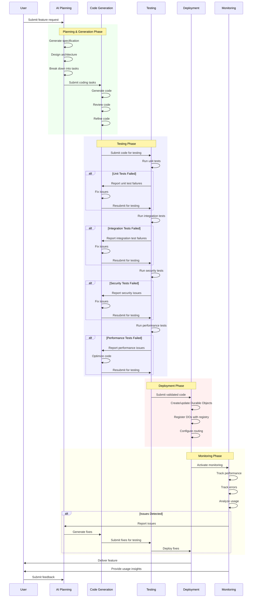

# AIDevOS CI/CD Pipeline Architecture

This document visualizes the architecture of the AI-driven CI/CD pipeline in the AIDevOS system.

## AI-Driven CI/CD Pipeline

```mermaid
graph TB
    subgraph "User Input"
        UserReq[User Request]
        Feedback[User Feedback]
    end
    
    subgraph "AI Planning"
        SpecGen[Specification Generator]
        ArchDesign[Architecture Designer]
        TaskBreakdown[Task Breakdown]
    end
    
    subgraph "Code Generation"
        CodeGen[Code Generator]
        CodeReview[Code Reviewer]
        CodeRefine[Code Refiner]
    end
    
    subgraph "Testing"
        UnitTest[Unit Testing]
        IntegTest[Integration Testing]
        SecTest[Security Testing]
        PerfTest[Performance Testing]
    end
    
    subgraph "Deployment"
        DOCreator[DO Creator]
        DOUpdater[DO Updater]
        DORegistry[DO Registry]
    end
    
    subgraph "Monitoring"
        PerfMonitor[Performance Monitor]
        ErrorTracker[Error Tracker]
        UsageAnalytics[Usage Analytics]
    end
    
    subgraph "Self-Improvement"
        LearningEngine[Learning Engine]
        ModelUpdater[Model Updater]
        KnowledgeBase[Knowledge Base]
    end
    
    % User Input to AI Planning
    UserReq -->|Requirements| SpecGen
    Feedback -->|Improvement Requests| SpecGen
    
    % AI Planning Flow
    SpecGen -->|Structured Spec| ArchDesign
    ArchDesign -->|System Architecture| TaskBreakdown
    
    % AI Planning to Code Generation
    TaskBreakdown -->|Coding Tasks| CodeGen
    
    % Code Generation Flow
    CodeGen -->|Generated Code| CodeReview
    CodeReview -->|Review Comments| CodeRefine
    CodeRefine -->|Refined Code| UnitTest
    
    % Testing Flow
    UnitTest -->|Unit Tested Code| IntegTest
    IntegTest -->|Integration Tested Code| SecTest
    SecTest -->|Security Tested Code| PerfTest
    
    % Testing to Deployment
    PerfTest -->|Validated Code| DOCreator
    PerfTest -.->|Performance Issues| CodeRefine
    
    % Deployment Flow
    DOCreator -->|New DOs| DORegistry
    DOUpdater -->|Updated DOs| DORegistry
    
    % Deployment to Monitoring
    DORegistry -->|Deployed DOs| PerfMonitor
    DORegistry -->|Deployed DOs| ErrorTracker
    DORegistry -->|Deployed DOs| UsageAnalytics
    
    % Monitoring to Self-Improvement
    PerfMonitor -->|Performance Metrics| LearningEngine
    ErrorTracker -->|Error Reports| LearningEngine
    UsageAnalytics -->|Usage Patterns| LearningEngine
    
    % Self-Improvement Flow
    LearningEngine -->|Learned Patterns| ModelUpdater
    LearningEngine -->|Knowledge Updates| KnowledgeBase
    
    % Self-Improvement to Code Generation
    ModelUpdater -->|Improved Models| CodeGen
    KnowledgeBase -->|Best Practices| CodeGen
    KnowledgeBase -->|Architecture Patterns| ArchDesign
    
    % Monitoring to Deployment
    PerfMonitor -.->|Scaling Needs| DOUpdater
    ErrorTracker -.->|Critical Fixes| DOUpdater
    
    % Monitoring to User
    ErrorTracker -.->|Issue Notifications| Feedback
    
    classDef userInput fill:#f9d5e5,stroke:#333,stroke-width:1px;
    classDef aiPlanning fill:#d5f9e5,stroke:#333,stroke-width:1px;
    classDef codeGen fill:#d5e5f9,stroke:#333,stroke-width:1px;
    classDef testing fill:#f9f9d5,stroke:#333,stroke-width:1px;
    classDef deployment fill:#f9e5d5,stroke:#333,stroke-width:1px;
    classDef monitoring fill:#e5d5f9,stroke:#333,stroke-width:1px;
    classDef selfImprove fill:#d5f9f9,stroke:#333,stroke-width:1px;
    
    class UserReq,Feedback userInput;
    class SpecGen,ArchDesign,TaskBreakdown aiPlanning;
    class CodeGen,CodeReview,CodeRefine codeGen;
    class UnitTest,IntegTest,SecTest,PerfTest testing;
    class DOCreator,DOUpdater,DORegistry deployment;
    class PerfMonitor,ErrorTracker,UsageAnalytics monitoring;
    class LearningEngine,ModelUpdater,KnowledgeBase selfImprove;
```

## CI/CD Pipeline Workflow



## Key Components

### 1. User Input
- **User Request**: Initial feature request or product specification
- **User Feedback**: Feedback on deployed features

### 2. AI Planning
- **Specification Generator**: Converts user requests into structured specifications
- **Architecture Designer**: Designs the system architecture
- **Task Breakdown**: Breaks down the architecture into coding tasks

### 3. Code Generation
- **Code Generator**: Generates code based on tasks
- **Code Reviewer**: Reviews generated code for quality and best practices
- **Code Refiner**: Refines code based on review comments

### 4. Testing
- **Unit Testing**: Tests individual components
- **Integration Testing**: Tests component interactions
- **Security Testing**: Tests for security vulnerabilities
- **Performance Testing**: Tests performance and scalability

### 5. Deployment
- **DO Creator**: Creates new Durable Objects
- **DO Updater**: Updates existing Durable Objects
- **DO Registry**: Registers and manages Durable Objects

### 6. Monitoring
- **Performance Monitor**: Monitors performance metrics
- **Error Tracker**: Tracks and reports errors
- **Usage Analytics**: Analyzes usage patterns

### 7. Self-Improvement
- **Learning Engine**: Learns from monitoring data
- **Model Updater**: Updates AI models based on learned patterns
- **Knowledge Base**: Stores best practices and patterns
