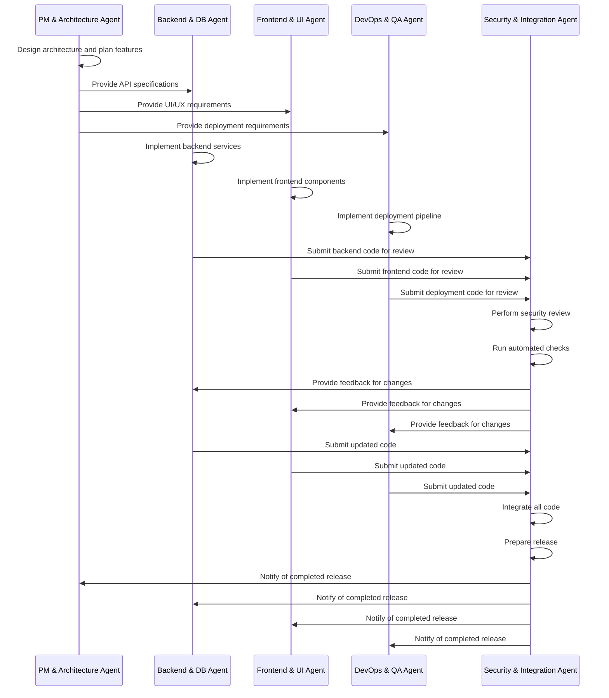

# AIDevOS Code Integration Process

This document outlines the code integration process for AIDevOS, ensuring smooth collaboration between different agents and maintaining the integrity of the codebase.

## Table of Contents

1. [Integration Workflow](#integration-workflow)
2. [Branch Strategy](#branch-strategy)
3. [Code Review Process](#code-review-process)
4. [Merge Conflict Resolution](#merge-conflict-resolution)
5. [Automated Checks](#automated-checks)
6. [Release Process](#release-process)
7. [Integration Best Practices](#integration-best-practices)

## Integration Workflow

The AIDevOS integration workflow is designed to coordinate changes from multiple AI agents, each responsible for different aspects of the system. The process follows these steps:

## Branch Strategy

AIDevOS uses a multi-branch strategy to organize development work:

### Main Branches

- **`main`**: The production-ready codebase
- **`develop`**: Integration branch for ongoing development

### Feature Branches

- **`pm-architecture`**: System design, feature planning, and architecture
- **`backend-db`**: API design, database models, and business logic
- **`frontend-ui`**: UI/UX design, frontend components, and user interactions
- **`devops-qa`**: CI/CD pipeline, testing, deployment, and monitoring

### Release Branches

- **`release-x.y.z`**: Preparation branches for specific releases
- Created from `develop` when preparing a release
- Merged into `main` and `develop` when the release is complete

### Hotfix Branches

- **`hotfix-x.y.z`**: Emergency fixes for production issues
- Created from `main` when a critical bug is identified
- Merged into `main` and `develop` when the fix is complete

## Code Review Process

All code changes go through a strict review process before integration:

### 1. Automated Checks

Before human review, automated checks are performed:

- **Style and formatting checks**: Ensures code adheres to style guidelines
- **Static analysis**: Identifies potential bugs and code smells
- **Security scanning**: Detects security vulnerabilities
- **Test coverage**: Verifies adequate test coverage

### 2. Security Review

The Security & Integration Agent reviews code for:

- **Security vulnerabilities**: SQL injection, XSS, CSRF, etc.
- **Authentication and authorization**: Proper implementation of access controls
- **Data protection**: Encryption and secure handling of sensitive data
- **Input validation**: Proper validation and sanitization of inputs

### 3. Architectural Review

The PM & Architecture Agent reviews code for:

- **Architectural alignment**: Adherence to the defined architecture
- **Design patterns**: Appropriate use of design patterns
- **Component boundaries**: Clear separation of concerns
- **Extensibility**: Ability to extend and modify the system

### 4. Functional Review

The respective agent (Backend, Frontend, DevOps) reviews code for:

- **Functionality**: Correct implementation of required features
- **Performance**: Efficient code with acceptable performance
- **Error handling**: Proper handling of error conditions
- **Edge cases**: Consideration of boundary conditions

## Merge Conflict Resolution

Merge conflicts are handled using the following process:

### 1. Detection

- Conflicts are detected during the integration process
- The Security & Integration Agent is notified of conflicts

### 2. Analysis

- The nature and extent of the conflict is analyzed
- Impacted components and agents are identified

### 3. Resolution

- For simple conflicts, the Security & Integration Agent resolves them
- For complex conflicts, a collaborative session with relevant agents is arranged
- Code is modified to resolve conflicts while maintaining functionality

### 4. Verification

- Resolved code is reviewed and tested
- All automated checks are run on the resolved code
- Manual testing may be performed for critical areas

## Automated Checks

AIDevOS employs various automated checks to ensure code quality:

### 1. Code Style

- **Linting**: Checks for style issues and potential errors
- **Formatting**: Ensures consistent code formatting
- **Complexity**: Identifies overly complex code

### 2. Security

- **Vulnerability scanning**: Detects security vulnerabilities
- **Dependency scanning**: Checks for vulnerable dependencies
- **Secret detection**: Prevents accidental commit of secrets

### 3. Testing

- **Unit tests**: Tests individual components in isolation
- **Integration tests**: Tests interaction between components
- **Coverage**: Ensures adequate test coverage

### 4. Performance

- **Static analysis**: Identifies potential performance issues
- **Benchmark tests**: Measures performance against baselines
- **Resource usage**: Monitors CPU, memory, and I/O usage

## Release Process

The release process follows these steps:

### 1. Release Planning

- Feature set for the release is defined
- Release schedule is established
- Release branch is created from `develop`

### 2. Release Preparation

- Final integration of all feature branches
- Comprehensive testing of the release branch
- Documentation is updated
- Release notes are prepared

### 3. Release Validation

- Validation tests are run
- Security audit is performed
- Performance benchmarks are checked

### 4. Release Deployment

- Release branch is merged into `main`
- Version tag is applied
- Artifacts are built and deployed
- Monitoring is enabled for the new release

### 5. Post-Release

- Release branch is merged back into `develop`
- Feedback and metrics are collected
- Lessons learned are documented

## Integration Best Practices

### Code Organization

- **Modular structure**: Organize code into modular components
- **Clear interfaces**: Define clear interfaces between components
- **Proper namespacing**: Use namespaces to avoid conflicts

### Documentation

- **Code comments**: Document complex logic and decisions
- **API documentation**: Document all public APIs
- **Architecture documentation**: Keep architecture diagrams up to date

### Collaboration

- **Early integration**: Integrate code frequently
- **Clear communication**: Communicate changes and intentions
- **Shared understanding**: Ensure all agents understand the system

### Quality Assurance

- **Test-driven development**: Write tests before code
- **Comprehensive testing**: Cover all critical functionality
- **Continuous monitoring**: Monitor system health after integration