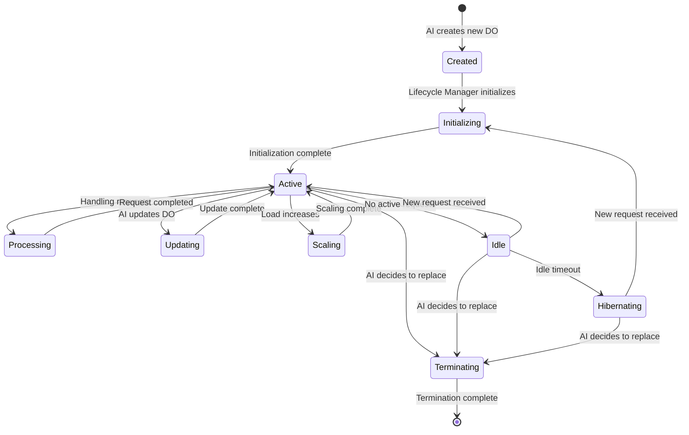

# AIDevOS Durable Objects Architecture

This document visualizes the architecture of Durable Objects as microservices in the AIDevOS system.

## Durable Objects Microservices Architecture

```mermaid
graph TB
    subgraph "Orchestration Layer"
        Registry[Service Registry]
        Router[Request Router]
        Lifecycle[Lifecycle Manager]
        StateManager[State Manager]
        EventBus[Event Bus]
    end
    
    subgraph "Durable Objects"
        DO_Auth[Authentication DO]
        DO_User[User Management DO]
        DO_Data[Data Storage DO]
        DO_API[API Gateway DO]
        DO_UI[UI Renderer DO]
        DO_Analytics[Analytics DO]
        DO_Notification[Notification DO]
        DO_Custom["Custom Service DO(s)"]
    end
    
    subgraph "External Systems"
        DB[(Database)]
        Storage[Storage Service]
        ThirdParty[Third-Party APIs]
    end
    
    subgraph "Client Applications"
        WebApp[Web Application]
        MobileApp[Mobile Application]
        APIClient[API Client]
    end
    
    % Orchestration Layer Internal Connections
    Registry <--> Router
    Registry <--> Lifecycle
    Router <--> StateManager
    StateManager <--> EventBus
    Lifecycle <--> StateManager
    
    % Client to System Connections
    WebApp -->|HTTP/WebSocket| Router
    MobileApp -->|HTTP/WebSocket| Router
    APIClient -->|HTTP| Router
    
    % Router to DOs Connections
    Router -->|Route Requests| DO_Auth
    Router -->|Route Requests| DO_User
    Router -->|Route Requests| DO_Data
    Router -->|Route Requests| DO_API
    Router -->|Route Requests| DO_UI
    Router -->|Route Requests| DO_Analytics
    Router -->|Route Requests| DO_Notification
    Router -->|Route Requests| DO_Custom
    
    % Registry to DOs Connections
    Registry -->|Register/Discover| DO_Auth
    Registry -->|Register/Discover| DO_User
    Registry -->|Register/Discover| DO_Data
    Registry -->|Register/Discover| DO_API
    Registry -->|Register/Discover| DO_UI
    Registry -->|Register/Discover| DO_Analytics
    Registry -->|Register/Discover| DO_Notification
    Registry -->|Register/Discover| DO_Custom
    
    % Lifecycle to DOs Connections
    Lifecycle -->|Create/Update/Delete| DO_Auth
    Lifecycle -->|Create/Update/Delete| DO_User
    Lifecycle -->|Create/Update/Delete| DO_Data
    Lifecycle -->|Create/Update/Delete| DO_API
    Lifecycle -->|Create/Update/Delete| DO_UI
    Lifecycle -->|Create/Update/Delete| DO_Analytics
    Lifecycle -->|Create/Update/Delete| DO_Notification
    Lifecycle -->|Create/Update/Delete| DO_Custom
    
    % StateManager to DOs Connections
    StateManager -->|Manage State| DO_Auth
    StateManager -->|Manage State| DO_User
    StateManager -->|Manage State| DO_Data
    StateManager -->|Manage State| DO_API
    StateManager -->|Manage State| DO_UI
    StateManager -->|Manage State| DO_Analytics
    StateManager -->|Manage State| DO_Notification
    StateManager -->|Manage State| DO_Custom
    
    % EventBus to DOs Connections
    EventBus -->|Publish/Subscribe| DO_Auth
    EventBus -->|Publish/Subscribe| DO_User
    EventBus -->|Publish/Subscribe| DO_Data
    EventBus -->|Publish/Subscribe| DO_API
    EventBus -->|Publish/Subscribe| DO_UI
    EventBus -->|Publish/Subscribe| DO_Analytics
    EventBus -->|Publish/Subscribe| DO_Notification
    EventBus -->|Publish/Subscribe| DO_Custom
    
    % DOs to External Systems Connections
    DO_Auth -->|Authenticate| ThirdParty
    DO_User -->|Store User Data| DB
    DO_Data -->|Store/Retrieve Data| DB
    DO_Data -->|Store/Retrieve Files| Storage
    DO_API -->|External API Calls| ThirdParty
    DO_Analytics -->|Store Analytics| DB
    DO_Notification -->|Send Notifications| ThirdParty
    
    classDef orchestration fill:#f9d5e5,stroke:#333,stroke-width:1px;
    classDef durableObjects fill:#d5f9e5,stroke:#333,stroke-width:1px;
    classDef external fill:#e5d5f9,stroke:#333,stroke-width:1px;
    classDef client fill:#d5e5f9,stroke:#333,stroke-width:1px;
    
    class Registry,Router,Lifecycle,StateManager,EventBus orchestration;
    class DO_Auth,DO_User,DO_Data,DO_API,DO_UI,DO_Analytics,DO_Notification,DO_Custom durableObjects;
    class DB,Storage,ThirdParty external;
    class WebApp,MobileApp,APIClient client;
```

## Durable Object Lifecycle



## Key Components

### 1. Orchestration Layer
- **Service Registry**: Maintains a registry of all active Durable Objects
- **Request Router**: Routes incoming requests to the appropriate Durable Object
- **Lifecycle Manager**: Manages the creation, updating, and deletion of Durable Objects
- **State Manager**: Manages the state of Durable Objects, including persistence and recovery
- **Event Bus**: Facilitates communication between Durable Objects

### 2. Durable Objects
- **Authentication DO**: Handles user authentication and authorization
- **User Management DO**: Manages user profiles and preferences
- **Data Storage DO**: Handles data storage and retrieval
- **API Gateway DO**: Serves as a gateway for external API calls
- **UI Renderer DO**: Renders UI components
- **Analytics DO**: Collects and analyzes usage data
- **Notification DO**: Sends notifications to users
- **Custom Service DO(s)**: Additional service-specific Durable Objects

### 3. External Systems
- **Database**: Stores persistent data
- **Storage Service**: Stores files and other binary data
- **Third-Party APIs**: External services integrated with the system

### 4. Client Applications
- **Web Application**: Browser-based client
- **Mobile Application**: Native mobile client
- **API Client**: Third-party client consuming the API
