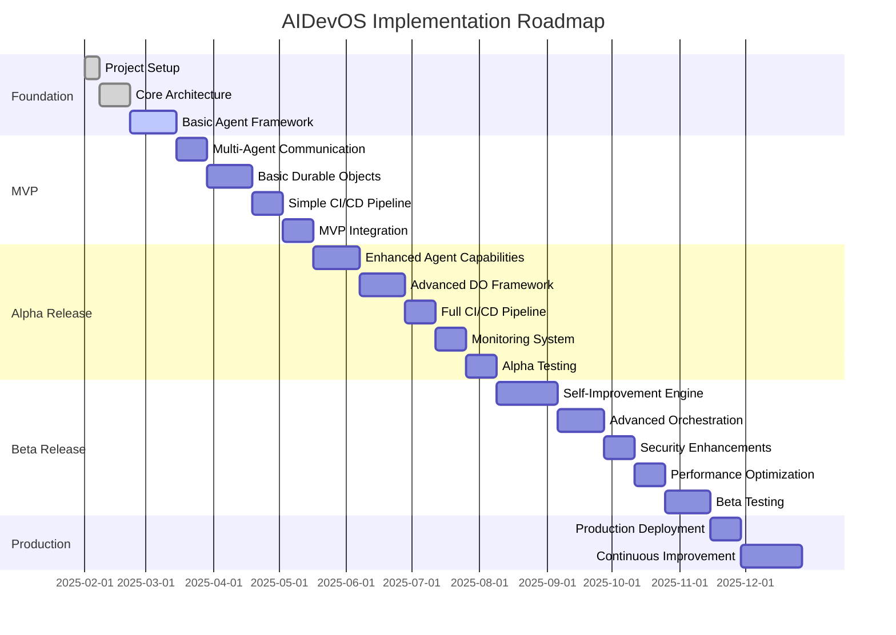
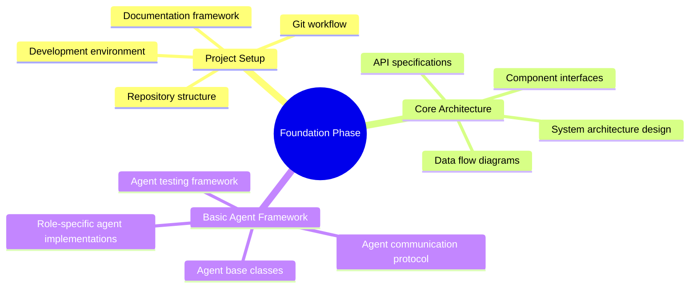
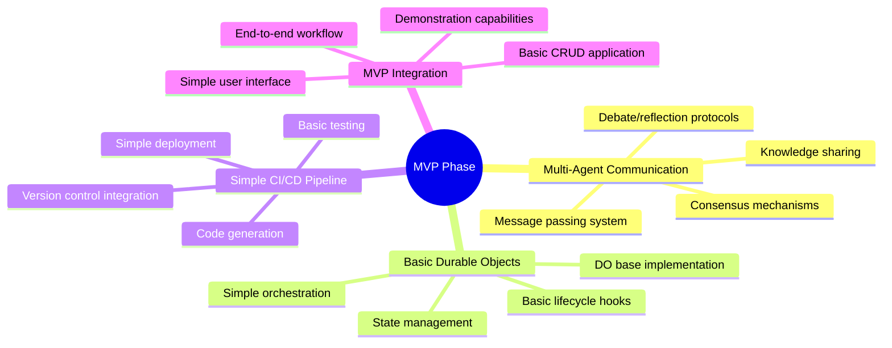
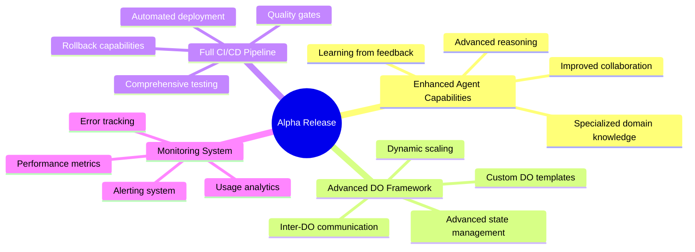
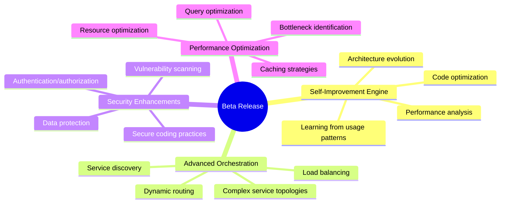
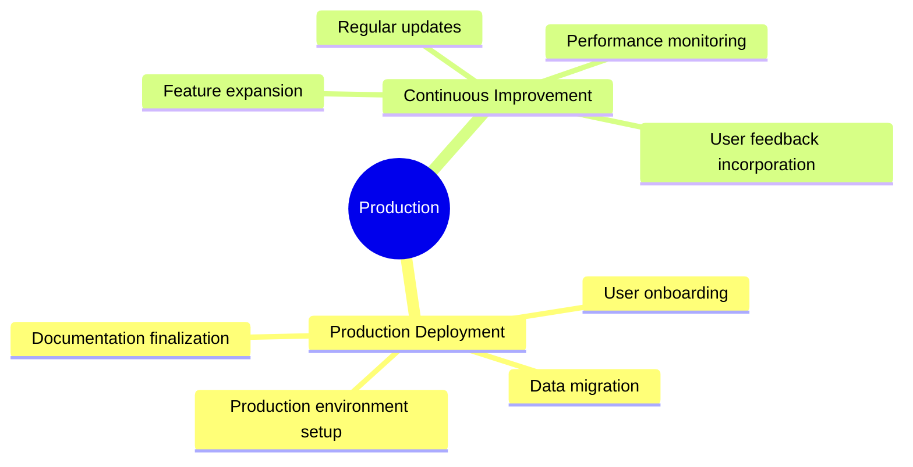

# AIDevOS Implementation Roadmap

This document outlines the implementation roadmap for the AIDevOS system, including phases, milestones, and key deliverables.

## Implementation Phases

## Milestone Details

### Foundation Phase

### MVP Phase

### Alpha Release Phase

### Beta Release Phase

### Production Phase

## Key Deliverables by Component

### 1. Multi-LLM Chat System

- **Foundation Phase**: Basic agent framework, role definitions
- **MVP Phase**: Simple agent communication, basic collaboration
- **Alpha Phase**: Enhanced reasoning, specialized knowledge
- **Beta Phase**: Advanced collaboration, self-improvement
- **Production**: Continuous knowledge expansion

### 2. Durable Objects Microservices

- **Foundation Phase**: Architecture design, interface definitions
- **MVP Phase**: Basic DO implementation, simple state management
- **Alpha Phase**: Advanced DO framework, inter-DO communication
- **Beta Phase**: Complex service topologies, dynamic scaling
- **Production**: Optimized performance, expanded capabilities

### 3. AI-Driven CI/CD Pipeline

- **Foundation Phase**: Pipeline architecture, basic workflows
- **MVP Phase**: Simple code generation, basic testing
- **Alpha Phase**: Comprehensive testing, automated deployment
- **Beta Phase**: Advanced quality gates, performance optimization
- **Production**: Continuous delivery, automated updates

### 4. Self-Improving Deployment Engine

- **Foundation Phase**: Monitoring architecture, metric definitions
- **MVP Phase**: Basic performance tracking, simple analytics
- **Alpha Phase**: Comprehensive monitoring, alerting system
- **Beta Phase**: Performance analysis, learning engine
- **Production**: Continuous optimization, predictive scaling
