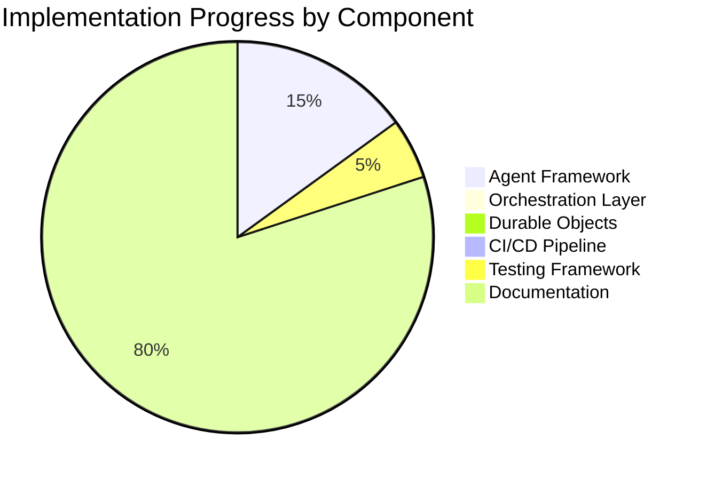

# AIDevOS Implementation Status

This document provides a status update on the AIDevOS implementation as of February 28, 2025.

## Current Implementation Status

The AIDevOS project is currently in the early Foundation Phase of development. The following components have been implemented:

### Agent Framework
- ✅ BaseAgent class with core functionality
- ✅ Agent communication protocol
- ✅ PM Agent specialization
- ✅ Basic task processing loop
- ✅ Initial unit tests

### Architecture Documentation
- ✅ System architecture diagrams
- ✅ Multi-agent workflow definition
- ✅ Durable Objects architecture
- ✅ CI/CD pipeline design
- ✅ Implementation roadmap
- ✅ Architecture refinement plan

### Development Infrastructure
- ✅ Project repository structure
- ✅ Basic documentation
- ✅ Development environment setup (requirements.txt)
- ✅ Basic test framework

## Implementation Progress

## Architecture Refinements

Based on our architecture analysis, we've made several key refinements to the original design:

1. **Modular Agent Architecture**: Enhanced the agent framework with clear separation of core functionality and specialized agent behavior.

2. **Enhanced Orchestration Layer**: Added a Service Composer to simplify agent interaction with Durable Objects.

3. **Self-Improvement Architecture**: Created a concrete feedback loop with measurable metrics and learning modules.

4. **Data Flow Architecture**: Defined clear interfaces between system components with explicit security boundaries.

5. **Scalability Architecture**: Designed for horizontal scaling with distributed nodes and sharded persistence.

## Next Steps

The following tasks are prioritized for immediate implementation:

1. **Agent Framework Enhancements** (in progress)
   - Implement remaining specialized agents (Backend, Frontend, DevOps)
   - Create agent state persistence mechanism
   - Enhance agent testing framework

2. **Basic Orchestration Layer**
   - Implement Service Registry
   - Create Request Router
   - Develop State Manager

3. **Simple Durable Object**
   - Implement base DO class
   - Create lifecycle management
   - Develop state persistence

## Architecture Decision Records

The following Architecture Decision Records (ADRs) have been approved:

### ADR-1: Agent Communication Protocol

**Status**: Accepted

**Context**: Agents need to communicate efficiently while maintaining a clear record of interactions, decisions, and reasoning.

**Decision**: Implement a structured message protocol with the following properties:
- JSON-based message format
- Required fields: sender, recipient, messageType, content, timestamp, messageId
- Optional fields: replyTo, metadata, attachments
- Support for broadcast messages to all agents
- Asynchronous message delivery with acknowledgments
- Persistence of message history

**Consequences**:
- All agent communication will be structured and traceable
- Message history provides context for decision-making
- Protocol overhead is acceptable for the benefits gained
- Future extensions can build on the established message structure

### ADR-2: Durable Object State Management

**Status**: Proposed

**Context**: Durable Objects need efficient state management that supports persistence, consistency, and scaling.

**Decision**: Implement a two-tiered state management approach:
- In-memory state for active operations
- Persistent state backed by a document database
- Optimistic concurrency control for state updates
- Event-sourced design for change tracking
- State versioning for migrations

**Consequences**:
- Objects can be efficiently hibernated and revived
- State history provides audit trail and recovery options
- Performance overhead for persistence is manageable
- Additional complexity in state management logic
- Requires careful handling of schema evolution

## Feature Roadmap

Based on our architectural refinements, here is the current feature roadmap:

| Priority | Feature | Status | Assigned To |
|----------|---------|--------|------------|
| 1 | Basic Agent Framework | In Progress | Backend Agent |
| 2 | Service Registry | Not Started | Backend Agent |
| 3 | Simple Durable Object | Not Started | Backend Agent |
| 4 | Agent State Persistence | Not Started | Backend Agent |
| 5 | Basic CI/CD Integration | Not Started | DevOps Agent |
| 6 | Event Bus Implementation | Not Started | Backend Agent |
| 7 | Metrics Collection | Not Started | DevOps Agent |
| 8 | Simple UI Dashboard | Not Started | Frontend Agent |
| 9 | Agent Specialization | In Progress | All Agents |
| 10 | Authentication Service | Not Started | Security Agent |

## Contributions by Agent

- **PM Agent**: Architecture design, feature planning, task management
- **Backend Agent**: Service implementation, data modeling, API design
- **Frontend Agent**: UI components, user experience, visualization
- **DevOps Agent**: Testing, deployment, monitoring
- **Security Agent**: Authentication, authorization, code review