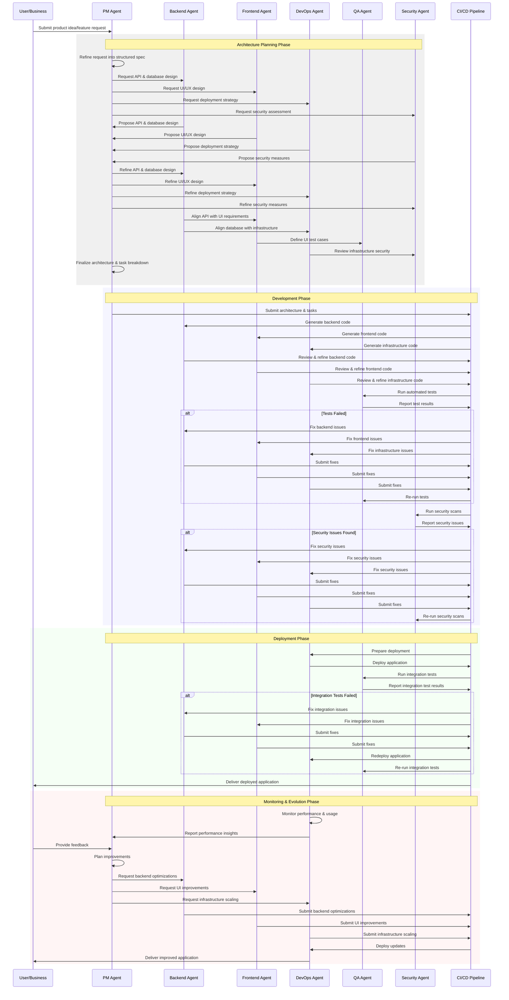

# AIDevOS Multi-Agent Workflow

This document visualizes the collaboration workflow between different AI agents in the AIDevOS system.

## Multi-Agent Collaboration Workflow

## Key Phases

### 1. Architecture Planning Phase
- PM Agent refines user request into structured specification
- Specialized agents propose designs for their domains
- Agents collaborate to align their designs
- PM Agent finalizes architecture and task breakdown

### 2. Development Phase
- CI/CD Pipeline generates code based on architecture and tasks
- Specialized agents review and refine the generated code
- QA Agent runs automated tests
- Security Agent runs security scans
- Issues are fixed iteratively

### 3. Deployment Phase
- DevOps Agent prepares and executes deployment
- QA Agent runs integration tests
- Integration issues are fixed iteratively
- Deployed application is delivered to the user

### 4. Monitoring & Evolution Phase
- DevOps Agent monitors performance and usage
- User provides feedback
- PM Agent plans improvements
- Specialized agents implement improvements
- Updates are deployed iteratively
