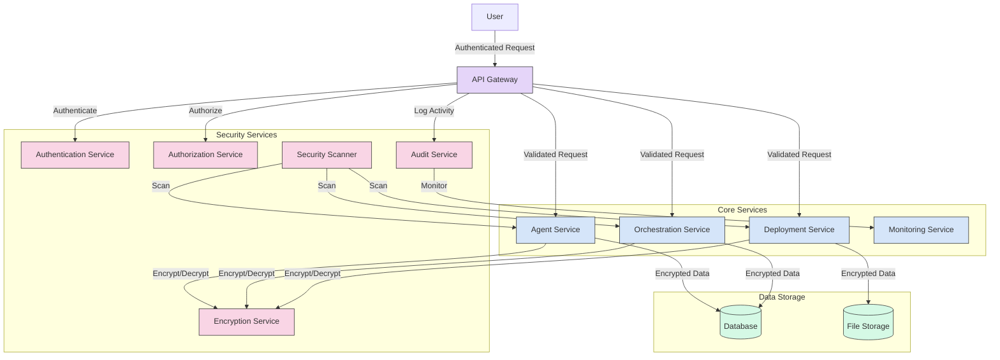

# AIDevOS Security Architecture

This document provides a comprehensive overview of the security architecture for the AIDevOS system, outlining the security measures implemented to protect the system against various threats and ensure compliance with security best practices.

## Table of Contents

1. [Security Overview](#security-overview)
2. [Authentication & Authorization](#authentication--authorization)
3. [Data Protection](#data-protection)
4. [Communication Security](#communication-security)
5. [API Security](#api-security)
6. [Infrastructure Security](#infrastructure-security)
7. [Vulnerability Management](#vulnerability-management)
8. [Compliance & Governance](#compliance--governance)
9. [Security Testing](#security-testing)
10. [Incident Response](#incident-response)

## Security Overview

The AIDevOS security architecture is designed around the following key principles:

- **Defense in Depth**: Multiple layers of security controls are implemented to protect the system.
- **Least Privilege**: Users and components have only the minimum access necessary to perform their functions.
- **Zero Trust**: No entity is trusted by default, regardless of its location inside or outside the network.
- **Secure by Design**: Security is integrated into the development lifecycle from the beginning.
- **Continuous Monitoring**: The system is continuously monitored for security events and anomalies.

The security architecture diagram shows the main security components and their relationships:

## Authentication & Authorization

### Authentication

AIDevOS implements JWT (JSON Web Token) based authentication:

1. **User Authentication Flow**:
   - User provides credentials
   - Authentication Service validates credentials
   - If valid, a signed JWT token is issued with user identity and roles
   - Token is returned to the client for use in subsequent requests

2. **Token Validation**:
   - Each request includes the JWT token in the Authorization header
   - API Gateway validates the token signature and expiration
   - If valid, the request proceeds; otherwise, it is rejected

3. **Token Management**:
   - Tokens have a configured expiration time (default: 30 minutes)
   - Refresh tokens can be issued for extended sessions
   - Tokens can be revoked for security reasons

### Authorization

Role-based access control (RBAC) is implemented to manage permissions:

1. **Role Definition**:
   - Predefined roles: Admin, Developer, Operator, Viewer
   - Custom roles can be created with specific permissions

2. **Permission Enforcement**:
   - Each API endpoint is protected by role requirements
   - Authorization middleware checks if the user has the required roles
   - Requests without sufficient permissions are rejected

3. **Privilege Management**:
   - Least privilege principle is enforced
   - Role assignments are reviewed regularly
   - Critical operations require additional verification

## Data Protection

### Data Encryption

1. **Data at Rest**:
   - Database encryption for sensitive data
   - File encryption for stored artifacts
   - Encryption keys are managed securely

2. **Data in Transit**:
   - All communications use TLS 1.2+ encryption
   - Secure cipher suites are enforced
   - Certificate validation is required

3. **Key Management**:
   - Encryption keys are rotated regularly
   - Keys are stored securely, separate from encrypted data
   - Key access is logged and audited

### Data Classification

Data is classified into the following categories:

1. **Public**: Information that can be freely shared
2. **Internal**: Information for internal use only
3. **Confidential**: Sensitive information that requires protection
4. **Restricted**: Highly sensitive information with strict access controls

Each category has specific handling requirements and security controls.

## Communication Security

1. **TLS Encryption**:
   - All API communications use TLS 1.2+
   - Strong cipher suites are enforced
   - Certificate validation is required

2. **API Gateway**:
   - Central point for communication security
   - Enforces TLS termination
   - Implements rate limiting and DDoS protection

3. **Service Mesh**:
   - Encrypts service-to-service communication
   - Implements mutual TLS for service authentication
   - Provides traffic management and observability

## API Security

1. **Input Validation**:
   - All API inputs are validated
   - Strict schema validation is enforced
   - Input sanitization is applied to prevent injection attacks

2. **Rate Limiting**:
   - Requests are rate-limited by IP and user
   - Configurable limits to prevent abuse
   - Graduated response to excessive requests

3. **CORS Protection**:
   - Strict Cross-Origin Resource Sharing policy
   - Allowed origins are explicitly configured
   - Credentials and headers are controlled

4. **CSRF Protection**:
   - Anti-CSRF tokens for state-changing operations
   - Token validation for all non-GET requests
   - Same-site cookie attributes

## Infrastructure Security

1. **Container Security**:
   - Minimal base images
   - No privileged containers
   - Image scanning for vulnerabilities
   - Runtime security monitoring

2. **Network Security**:
   - Network segmentation for isolation
   - Restrictive network policies
   - Ingress and egress filtering
   - Internal traffic encryption

3. **Secret Management**:
   - Centralized secret management
   - Just-in-time access to secrets
   - Rotation and versioning
   - Audit logging for secret access

## Vulnerability Management

1. **Security Scanning**:
   - Automated code scanning for vulnerabilities
   - Dependency scanning for known CVEs
   - Secret detection to prevent credential leakage
   - Regular penetration testing

2. **Patch Management**:
   - Timely application of security patches
   - Vulnerability prioritization based on risk
   - Critical vulnerabilities addressed within 24 hours
   - Regular vulnerability assessment

3. **Third-Party Dependencies**:
   - Vulnerability scanning for dependencies
   - Approval process for new dependencies
   - Dependency updates and version management
   - Supply chain security measures

## Compliance & Governance

1. **Audit Logging**:
   - Comprehensive logging of security events
   - Tamper-proof log storage
   - Log retention policy
   - Log analysis for security incidents

2. **Security Policies**:
   - Documented security policies
   - Regular policy reviews
   - Security awareness training
   - Compliance monitoring

3. **Access Reviews**:
   - Regular access reviews
   - Privilege right-sizing
   - Orphaned account detection
   - Separation of duties enforcement

## Security Testing

1. **Unit Testing**:
   - Security-focused unit tests
   - Authentication and authorization tests
   - Encryption and decryption tests
   - Input validation tests

2. **Integration Testing**:
   - Security component integration tests
   - End-to-end security workflow tests
   - Boundary condition testing
   - Error handling tests

3. **Penetration Testing**:
   - Regular penetration testing
   - Vulnerability scanning
   - Red team exercises
   - Bug bounty program

## Incident Response

1. **Detection**:
   - Security event monitoring
   - Anomaly detection
   - Alert correlation
   - Threat intelligence integration

2. **Response Plan**:
   - Documented incident response procedures
   - Defined roles and responsibilities
   - Communication plan
   - Isolation and containment procedures

3. **Recovery**:
   - System restoration procedures
   - Data recovery plan
   - Post-incident analysis
   - Lessons learned and improvements

## Implementation Roadmap

The security architecture will be implemented in phases:

1. **Phase 1: Foundation**
   - Authentication and authorization services
   - API security basic controls
   - Data encryption for sensitive data
   - Security logging

2. **Phase 2: Advanced Protection**
   - Vulnerability management system
   - Automated security scanning
   - Enhanced API security
   - Network security controls

3. **Phase 3: Compliance and Monitoring**
   - Comprehensive audit logging
   - Compliance monitoring
   - Access reviews and governance
   - Security monitoring and alerting

4. **Phase 4: Continuous Improvement**
   - Security testing automation
   - Advanced threat detection
   - Security metrics and KPIs
   - Continuous security assessment