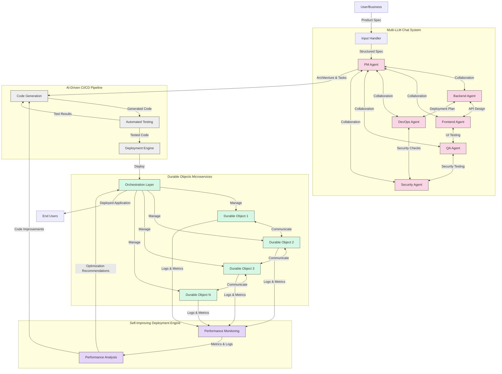

# AIDevOS System Architecture

This document provides a high-level overview of the AIDevOS system architecture.

## High-Level System Architecture

## Key Components

### 1. Multi-LLM Chat System
- **Input Handler**: Processes user inputs and converts them into structured specifications
- **AI Agents**: Specialized agents for different aspects of development (PM, Backend, Frontend, DevOps, QA, Security)
- **Collaboration**: Agents communicate and collaborate to refine architecture and tasks

### 2. AI-Driven CI/CD Pipeline
- **Code Generation**: AI writes modular code based on the architecture and tasks
- **Automated Testing**: Tests the generated code for functionality, performance, and security
- **Deployment Engine**: Deploys the code as Durable Objects

### 3. Durable Objects Microservices
- **Orchestration Layer**: Manages the lifecycle of Durable Objects
- **Durable Objects**: Independent microservices, each handling a specific task
- **Communication**: Objects communicate with each other through the Orchestration Layer

### 4. Self-Improving Deployment Engine
- **Performance Monitoring**: Collects logs and metrics from Durable Objects
- **Performance Analysis**: Analyzes performance data to identify optimization opportunities
- **Continuous Improvement**: Recommends optimizations and code improvements
