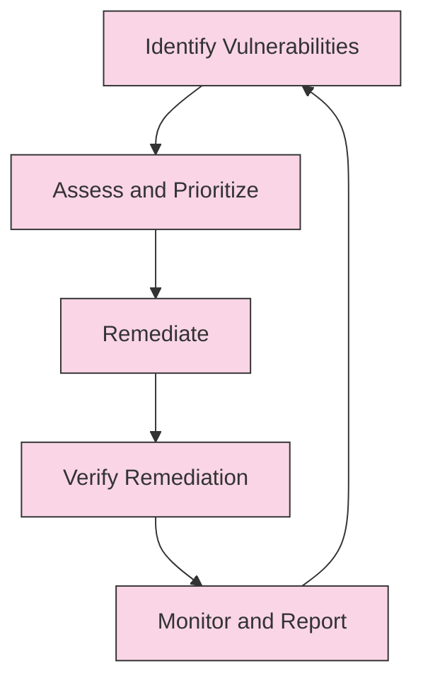

# AIDevOS Vulnerability Management Process

This document outlines the vulnerability management process for AIDevOS, ensuring the system is protected against security vulnerabilities throughout its lifecycle.

## Table of Contents

1. [Vulnerability Management Lifecycle](#vulnerability-management-lifecycle)
2. [Vulnerability Identification](#vulnerability-identification)
3. [Vulnerability Assessment](#vulnerability-assessment)
4. [Vulnerability Remediation](#vulnerability-remediation)
5. [Vulnerability Verification](#vulnerability-verification)
6. [Vulnerability Metrics and Reporting](#vulnerability-metrics-and-reporting)
7. [Tools and Automation](#tools-and-automation)
8. [Roles and Responsibilities](#roles-and-responsibilities)

## Vulnerability Management Lifecycle

The AIDevOS vulnerability management process follows a continuous lifecycle:

## Vulnerability Identification

Vulnerabilities are identified through various methods:

### 1. Automated Security Scanning

- **Code Scanning**: Static code analysis to identify security issues
- **Dependency Scanning**: Analysis of third-party dependencies for known vulnerabilities
- **Secret Detection**: Identification of hardcoded secrets and credentials
- **Container Scanning**: Analysis of container images for vulnerabilities

### 2. Security Testing

- **Penetration Testing**: Simulated attacks to identify vulnerabilities
- **Security-focused Unit Tests**: Tests specifically designed to verify security controls
- **Fuzz Testing**: Testing with invalid, unexpected, or random data inputs

### 3. External Sources

- **Vulnerability Databases**: Monitoring of CVE and other vulnerability databases
- **Security Advisories**: Vendor and community security advisories
- **Threat Intelligence**: Information about emerging threats and attack vectors

### 4. Internal Reporting

- **Developer Reports**: Issues identified by development team
- **Automated Alerts**: Alerts from monitoring and detection systems
- **Security Reviews**: Findings from security reviews and audits

## Vulnerability Assessment

Once identified, vulnerabilities are assessed and prioritized:

### 1. Severity Classification

Vulnerabilities are classified into severity levels:

- **Critical**: Immediate action required, system at risk of compromise
- **High**: Urgent action required, significant security impact
- **Medium**: Action required, moderate security impact
- **Low**: Action recommended, minimal security impact
- **Informational**: No immediate action required, minimal security impact

### 2. Risk Assessment

Risk is assessed based on multiple factors:

- **Exploitability**: How easily the vulnerability can be exploited
- **Impact**: The potential damage if the vulnerability is exploited
- **Affected Components**: Which system components are affected
- **Data Sensitivity**: Whether sensitive data is at risk
- **Mitigating Controls**: Whether other controls reduce the risk

### 3. Prioritization

Remediation is prioritized based on:

- **Severity**: Higher severity vulnerabilities are addressed first
- **Exploitation Status**: Vulnerabilities being actively exploited receive priority
- **System Criticality**: Vulnerabilities in critical systems receive priority
- **Remediation Effort**: Quick fixes may be implemented before complex ones
- **Business Impact**: Vulnerabilities with high business impact receive priority

## Vulnerability Remediation

The remediation process includes:

### 1. Remediation Planning

- **Assignment**: Vulnerabilities are assigned to appropriate teams
- **Timeframes**: Remediation timeframes are established
- **Approach**: Remediation approach is determined

Remediation timeframes based on severity:

| Severity | Remediation Timeframe |
|----------|------------------------|
| Critical | 24 hours              |
| High     | 7 days                |
| Medium   | 30 days               |
| Low      | 90 days               |
| Info     | As appropriate        |

### 2. Remediation Methods

Vulnerabilities are remediated using appropriate methods:

- **Patching**: Applying security patches to affected components
- **Reconfiguration**: Changing configurations to secure systems
- **Code Fixes**: Modifying code to fix security issues
- **Compensating Controls**: Implementing controls to mitigate risk
- **Component Replacement**: Replacing vulnerable components

### 3. Emergency Response

For critical vulnerabilities:

- **Emergency Response Team**: A dedicated team is assembled
- **Accelerated Process**: Expedited remediation process
- **Communication Plan**: Clear communication of actions and status
- **Isolation**: Affected components may be isolated if necessary

## Vulnerability Verification

After remediation, verification ensures the vulnerability is properly addressed:

### 1. Verification Testing

- **Automated Testing**: Automated tests to verify fixes
- **Manual Testing**: Manual verification of complex fixes
- **Regression Testing**: Testing to ensure fixes don't introduce new issues
- **Penetration Testing**: Testing to verify exploitation is no longer possible

### 2. Documentation

- **Remediation Record**: Documentation of the remediation actions
- **Evidence**: Evidence that the vulnerability is fixed
- **Lessons Learned**: Documentation of lessons learned

## Vulnerability Metrics and Reporting

Metrics and reporting provide visibility into the vulnerability management process:

### 1. Key Metrics

- **Open Vulnerabilities**: Count of open vulnerabilities by severity
- **Mean Time to Remediate**: Average time to fix vulnerabilities
- **Vulnerability Aging**: Age of open vulnerabilities
- **Remediation Rate**: Rate at which vulnerabilities are fixed
- **Recurring Vulnerabilities**: Count of vulnerabilities that recur

### 2. Reporting

- **Executive Dashboard**: High-level view for executives
- **Team Reports**: Detailed reports for security and development teams
- **Trend Analysis**: Analysis of vulnerability trends over time
- **Compliance Reports**: Reports for compliance requirements

## Tools and Automation

AIDevOS uses various tools to automate the vulnerability management process:

### 1. Scanning Tools

- **Code Scanner**: Static code analysis for security issues
- **Dependency Scanner**: Analysis of dependencies for vulnerabilities
- **Secret Scanner**: Detection of hardcoded secrets and credentials
- **Container Scanner**: Analysis of container images

### 2. Management Tools

- **Vulnerability Tracker**: Tracking and management of vulnerabilities
- **Workflow Automation**: Automation of remediation workflow
- **Integration Tools**: Integration with development tools
- **Reporting Tools**: Generation of vulnerability reports

### 3. Integration

- **CI/CD Integration**: Integration with CI/CD pipeline
- **Issue Tracker Integration**: Integration with issue tracking system
- **Notification Integration**: Integration with notification systems
- **SCM Integration**: Integration with source code management

## Roles and Responsibilities

### Security & Integration Agent

- Manage the overall vulnerability management process
- Perform security scanning and testing
- Prioritize and track vulnerabilities
- Verify remediation of vulnerabilities
- Report on vulnerability status and metrics

### Development Agents (PM, Backend, Frontend, DevOps)

- Implement security controls in respective areas
- Remediate vulnerabilities in respective components
- Participate in security testing
- Implement secure coding practices
- Report potential security issues

### Shared Responsibilities

- Continuous monitoring for vulnerabilities
- Regular security assessments
- Security knowledge sharing
- Improvement of security practices
- Documentation of security policies and procedures