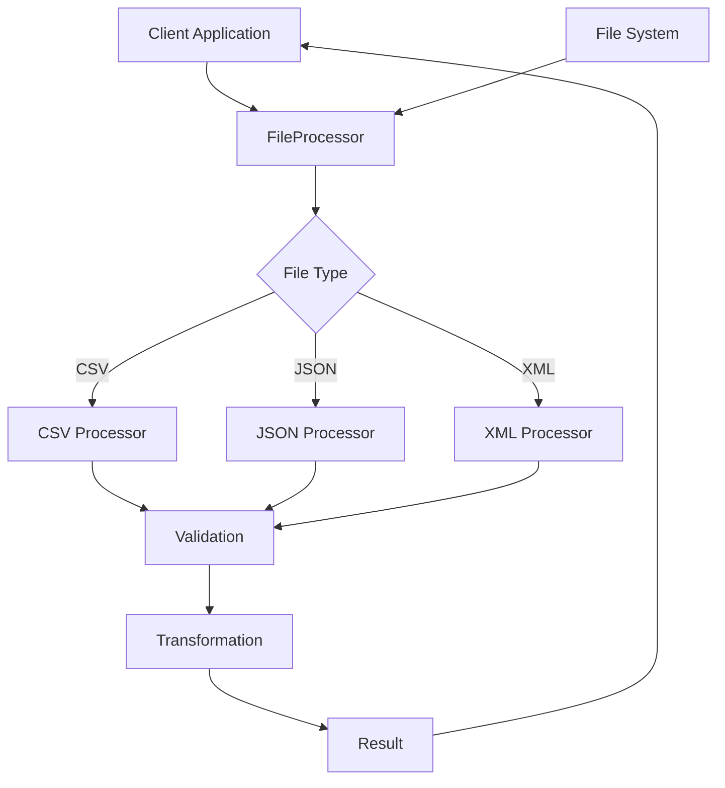

# FileProcessor

A comprehensive Elixir library for processing, validating, and transforming different file formats including CSV, JSON, and XML.

## Architecture



## Installation

Add `file_processor` to your list of dependencies in `mix.exs`:

```elixir
def deps do
  [{:file_processor, "~> 0.1.0"}]
end
```

## Usage

To process a file, call:

```elixir
FileProcessor.process_file("path/to/file.csv", :csv)
```

Supported file types are CSV, JSON, and XML.

## Configuration

No additional configuration is required for basic usage.

## Testing

Run tests with `mix test`.