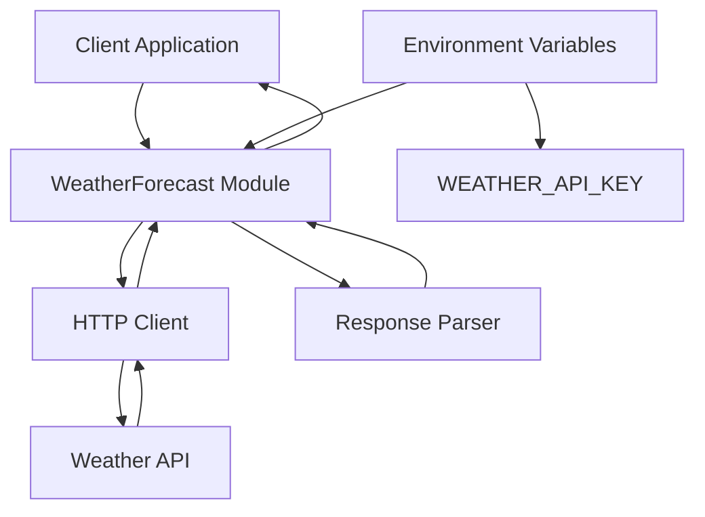

# WeatherForecast

## Installation
1. Add WeatherForecast to your list of dependencies in `mix.exs`:
```elixir
{:weather_forecast, "~> 0.1.0"}
```
2. Run `mix deps.get`

## Configuration
Ensure you have set the `WEATHER_API_KEY` environment variable to your API key for the weather service.

## Architecture



## Usage
To fetch the weather forecast for a city:
```elixir
WeatherForecast.fetch_forecast("New York")